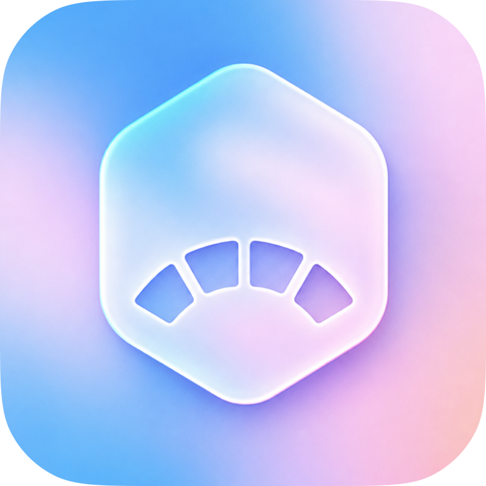
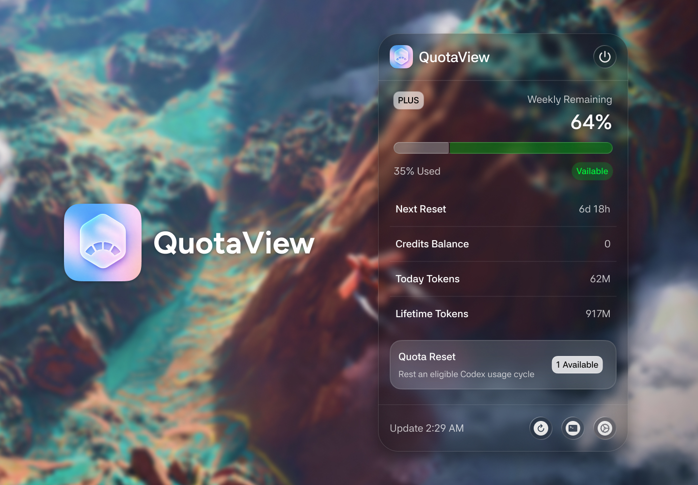

<p align="center">
  
</p>

<h1 align="center">QuotaView</h1>

<p align="center">
  A simple, lightweight way to see your Codex quota, Credits, token usage, and reset time from the macOS menu bar.
</p>

<p align="center">
  <a href="https://github.com/Duoasa/QuotaView/releases/tag/v0.2.0-build.4"></a>
  <a href="https://github.com/Duoasa/QuotaView/actions/workflows/ci.yml"></a>
  
  
</p>

<p align="center">
  <a href="https://github.com/Duoasa/QuotaView/releases/download/v0.2.0-build.4/QuotaView-v0.2.0-build.4.zip"><strong>Download QuotaView v0.2.0 Build 4</strong></a>
  ·
  <a href="#privacy-by-design">Privacy</a>
  ·
  <a href="#build-and-test">Build from source</a>
</p>

<p align="center">
  <strong>English</strong> · <a href="README.zh-CN.md">简体中文</a>
</p>



QuotaView is a simple, lightweight, native macOS menu bar app for the Codex account already signed in on your Mac. It keeps the information you need within easy reach before a limit interrupts your work, without clutter, web scraping, or reading login credentials from `~/.codex`.

## Why QuotaView

| | |
| --- | --- |
| **At a glance** | See used and remaining quota, reset countdowns, Credits, and availability without leaving your current app. |
| **Local connection** | Communicates with a locally launched `codex app-server` process through its JSON-RPC interface. |
| **Simple by design** | Focuses on essential quota information with a compact, uncluttered interface. |
| **Lightweight** | Built natively with SwiftUI and AppKit, with no embedded browser runtime. |
| **Made to fit** | Choose what appears in the menu bar and which sections appear in the panel. |

## Quick start

1. Make sure ChatGPT or Codex is installed and signed in.
2. Download `QuotaView-v0.2.0-build.4.zip` from the [v0.2.0 Build 4 release](https://github.com/Duoasa/QuotaView/releases/tag/v0.2.0-build.4).
3. Unzip it and open `QuotaView.app`.

> [!IMPORTANT]
> v0.2.0 Build 4 fixes the launch-time framework validation failure in the
> withdrawn Build 3 package. The fallback package uses an ad-hoc signature
> without Hardened Runtime and is not notarized. If macOS blocks the first
> launch, right-click `QuotaView.app` in Finder and choose **Open**.
> Developer ID signing and notarization are on the roadmap.

The universal app supports macOS 14 or later on both Apple Silicon and Intel Macs. The first account request after launching from Finder may take 20–30 seconds; later refreshes are usually much faster.

## What it shows

- Current plan and service availability
- Weekly used quota and remaining percentage
- Countdown to the next quota reset
- Plan quota and additional Credits as separate values
- Available quota reset credits
- Recent daily and lifetime token usage
- Near-limit, exhausted, offline, and App Server error states

## Native experience

- Compact status item with a dynamically sized menu panel
- Automatic refresh every 60 seconds and manual refresh
- Configurable menu bar values and six optional panel sections
- Frosted and clear glass appearances with light/dark adaptation
- Native Liquid Glass on macOS 26 and a Material fallback on macOS 14–15
- System-aware or fixed light/dark appearance
- English and Simplified Chinese interfaces
- Native Settings window for Menu Bar, Popover, Appearance, Language, and General options

## What's new in 0.2.0

v0.2.0 is the first official release built on QuotaView's refactored core.

### Build 4 hot update

- Refines buttons, the quota-reset entry and action, the subscription tag,
  and the Codex connection-status label from the latest UI1/UI2 designs.
- Updates the light-appearance function icons and the macOS menu bar icon.
- Fixes the connection-status label so its 18 pt height keeps a 6 pt corner
  radius instead of collapsing into a pill shape.
- Keeps reset-credit display on the live Codex data path with no debug fixture.
- Fixes the downloaded app failing before launch because an ad-hoc Hardened
  Runtime host could not load its embedded `QuotaViewCore` framework.

### Core release

- A normalized domain and static provider registry prepare QuotaView for more
  official AI data sources without adding a plugin runtime.
- A generation- and revision-aware refresh coordinator prevents stale requests
  from overwriting newer account state.
- App Server requests now use bounded output, separate startup/request timeouts,
  and isolated optional usage failures.
- Token usage is not requested when both token sections are disabled.
- Foundation-only contracts prepare history, charts, notifications, and a
  future WidgetKit extension without adding background work to this build.
- The existing compact interface, bilingual experience, and read-only safety
  boundary remain unchanged.

## Privacy by design

QuotaView does **not**:

- scrape account web pages;
- read, copy, or store login credentials from `~/.codex`;
- store full account responses or authentication tokens.

QuotaView starts the local `codex app-server` process and requests account data over JSON-RPC. It stores only the latest successful refresh time, availability state, a short error summary, and display preferences in its own macOS preferences domain.

Version 0.2.0 is read-only by default and contains no live account-operation
executor. The quota reset flow remains a local demo. The architecture reserves
separate, explicitly authorized official operations for a future release
without allowing refreshes to trigger side effects.

For local diagnostics:

```bash
defaults read com.quotaview.menubar
```

The app target disables App Sandbox because it must launch the locally installed `codex app-server`.

## Requirements

- macOS 14 or later
- ChatGPT/Codex installed and signed in
- Swift 6 or Xcode 16+ only when building from source

QuotaView looks for the Codex executable in this order:

1. `CODEX_EXECUTABLE`
2. `/Applications/ChatGPT.app/Contents/Resources/codex`
3. `/opt/homebrew/bin/codex`
4. `/usr/local/bin/codex`
5. The current `PATH`

## Current limitations

- Version 0.2.0 currently supports Codex only; more official providers are
  planned through the static provider registry.
- The quota reset interface is a safety-focused demo and does not call `account/rateLimitResetCredit/consume`.
- The App Server schema can vary with the installed Codex version.
- The current downloadable build is not notarized.

## Build and test

Clone the repository and run the unit tests:

```bash
git clone https://github.com/Duoasa/QuotaView.git
cd QuotaView
swift test
```

Run the read-only data probe:

```bash
swift run QuotaViewProbe
```

The probe prints the plan, quota percentages, reset time, Credits balance, and lifetime token usage. It never prints login credentials.

Run the app during development:

```bash
swift run QuotaView
```

Or create the Universal release app and ZIP:

```bash
chmod +x scripts/build-app.sh
./scripts/build-app.sh
open dist/QuotaView.app
```

The build script prefers a Developer ID Application identity, then an Apple Development identity. Those Team ID-bearing identities keep Hardened Runtime enabled. When neither identity is available, the script falls back to an ad-hoc signature without Hardened Runtime so the embedded framework remains loadable. Only Developer ID Application builds can use the notarization path:

```bash
CODESIGN_IDENTITY="Developer ID Application: Name (TEAMID)" \
NOTARY_PROFILE="<keychain-profile>" \
./scripts/build-app.sh
```

To use Xcode, open `QuotaView.xcodeproj`, select the shared **QuotaView** scheme and **My Mac**, then run or test.

## Data protocol

After initialization, the client requests:

```text
initialize
initialized
account/rateLimits/read
account/usage/read  # only when either token section is enabled
```

| UI value | App Server field |
| --- | --- |
| Availability | `rateLimitReachedType`, `spendControlReached`, `primary.usedPercent` |
| Used quota | `primary.usedPercent` |
| Remaining quota | `100 - primary.usedPercent` |
| Reset time | `primary.resetsAt` |
| Credits | `credits.balance`, `credits.unlimited` |
| Reset credits | `rateLimitResetCredits.availableCount` |
| Tokens | `summary.lifetimeTokens`, `dailyUsageBuckets` |

Credits and remaining plan quota are separate concepts and are never combined in the UI.

## Project structure

```text
Sources/
├── QuotaView/              # SwiftUI views, settings, and AppKit menu panel
├── QuotaViewCore/          # Domain, providers, refresh, and account-operation boundary
├── QuotaViewFutureContracts/# Unlinked history, chart, display, and notification contracts
├── QuotaViewWidgetContract/# Foundation-only bounded widget snapshot contract
└── QuotaViewProbe/         # Read-only command-line probe
Resources/
├── Assets.xcassets/        # App, menu bar, and interface artwork
└── Fonts/                  # Bundled Asta Sans font files
Tests/
└── QuotaViewCoreTests/     # Domain, app behavior, process, and contract tests
```

## Roadmap

- [ ] Active task status and real-time notifications
- [ ] Launch at login with `ServiceManagement`
- [ ] Historical trends and quota alerts
- [ ] WidgetKit extension backed by an App Group
- [ ] More AI providers
- [ ] Separately authorized official account operations
- [ ] Developer ID signing, notarization, and automatic updates

## Feedback and contributions

Bug reports, compatibility reports, and focused feature proposals are welcome. Start with the [issue templates](https://github.com/Duoasa/QuotaView/issues/new/choose), and read [CONTRIBUTING.md](CONTRIBUTING.md) before preparing a code change.

Please never include authentication tokens, credentials, or an unredacted `~/.codex` file in an issue.
