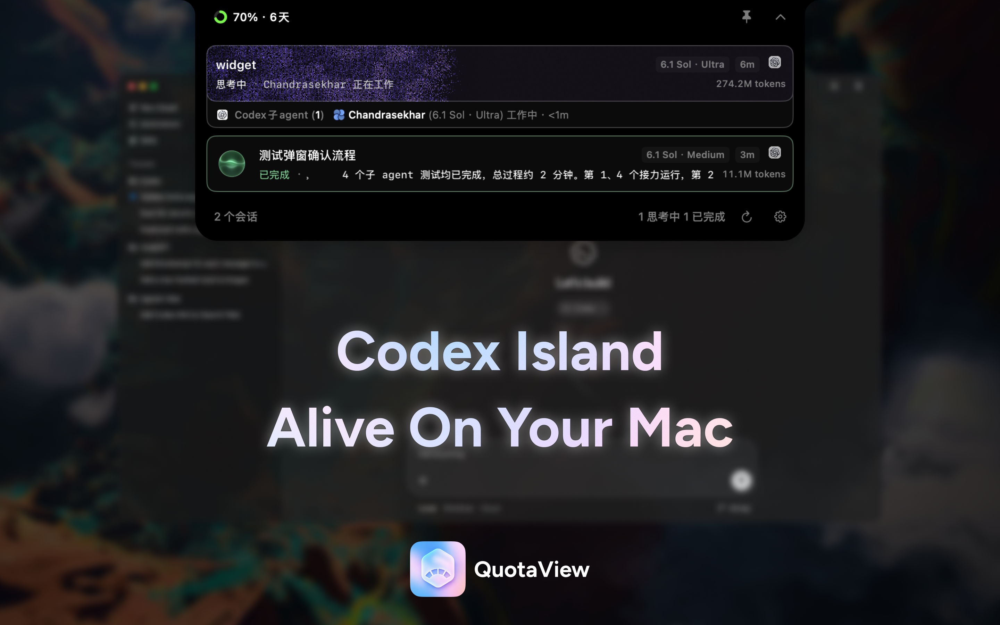

<p align="center">
  
</p>

<h1 align="center">QuotaView · Codex Island for macOS</h1>

<p align="center">
  Keep Codex visible while you work.
</p>

<p align="center">
  Live status, progress, approvals, turn tokens, completion receipts, and quota—inside one native Island.
</p>

<p align="center">
  <a href="https://github.com/Duoasa/QuotaView/releases/tag/v0.7.7-build.1"></a>
  <a href="https://github.com/Duoasa/QuotaView/actions/workflows/ci.yml"></a>
  
  
  <a href="LICENSE"></a>
</p>

<p align="center">
  <a href="https://github.com/Duoasa/QuotaView/releases/download/v0.7.7-build.1/QuotaView-v0.7.7-build.1.zip"><strong>Download QuotaView v0.7.7 Build 1</strong></a>
  ·
  <a href="#get-started">Get started</a>
  ·
  <a href="#privacy-by-design">Privacy</a>
  ·
  <a href="#build-from-source">Build from source</a>
</p>

<p align="center">
  <strong>English</strong> · <a href="README.zh-CN.md">简体中文</a>
</p>

<p align="center">
  
</p>

Keep parallel work in view without switching windows. QuotaView brings tasks, agent collaboration, confirmations, and usage into a native **Codex Island** beneath the menu bar.

QuotaView is open source, lightweight, and local-first. Active local sessions are discovered automatically, with quota and usage one click away.

## 0.7.7: smoother tasks and confirmations

- **More reliable confirmations:** fixes delayed approval details, temporarily unavailable options, and stale waiting states after a request is handled. macOS permission dialogs remain under system control.
- **Smoother long sessions:** reduces repeated history processing and unnecessary redraws to keep the Island responsive.
- **Clearer completion results:** shows the Codex answer directly, with readable text hierarchy and clickable links. Starting a new session no longer clears completed cards.
- **Refined compact view:** briefly shows remaining quota after completion, rotates session/completion counts only when needed, and gives memory maintenance a labeled, dedicated indicator.

## 0.7.5: our biggest update yet

QuotaView 0.7.5 is our largest redesign and architectural update to date. The new multi-task Island brings task progress, collaboration, and quota together, making parallel work easier to follow.

- **Multiple tasks:** follow concurrent sessions, inspect progress and details, and review completed results.
- **Multi-agent collaboration:** see subagents beneath their parent task, with individual identities and live states.
- **Task confirmations:** find requests that need your attention and respond to supported confirmations directly.
- **A new usage dashboard:** see quota, reset times, and token activity in one place.

Rebuilt data reception and state synchronization improve information continuity across long sessions and concurrent tasks. A dedicated feedback page makes it easier to report issues and share suggestions.

## The Codex Island

| Moment | What the Island shows |
| --- | --- |
| **Thinking and working** | Task title, public progress, model, elapsed time, and token usage. |
| **Parallel tasks** | A separate card for each session, with expandable details and completion results. |
| **Agent collaboration** | A strip extending below the parent card, with individual avatars, names, models, and states. Long groups scroll in one direction. |
| **Approval required** | Highlighted requests, bounded previews, and supported confirmation actions. |
| **Memory maintenance** | A labeled indicator in the footer with the context-compaction orb, separate from the task list. |
| **Task completed** | The result remains available for review; cards can be archived locally. |

The Island distinguishes thinking, tools, approvals, context compaction, completion, interruption, and failure. Progress reaches 100% only on a real completion event. Compact and expanded views keep the same task context.

## Ready when Codex starts

- **Automatic discovery.** Start a local task and QuotaView follows its activity without first-run Hook setup.
- **Unified state.** Session metadata, live events, and public progress feed the same task presentation.
- **Compatibility paths.** Local App Server and signed Activity Hook support complement local activity discovery.
- **Explicit actions.** Observation is read-only. Supported requests can be answered only through your action; unavailable controls open the task in its original window.

## Quota and usage, one click away

Open usage statistics from the Island to see the account and usage behind your work.

<p align="center">
  
</p>

| Surface | What it is for |
| --- | --- |
| **Menu bar** | Keep a chosen quota value or reset countdown visible without opening a window. |
| **Usage dashboard** | Review every available Codex quota window, Spark quota, reset times, Credits, latest-day and 30-day tokens, and lifetime usage. |
| **Token Activity** | Explore token activity across daily, weekly, and cumulative views. |
| **Cost estimate** | See a clearly labeled local 30-day estimate. It is an estimate, not a bill. |
| **Widgets** | Place native Small or Medium WidgetKit views on the desktop for quota and reset information. |
| **Updates** | Check the Stable channel manually or opt into a native check every 24 hours. Installing an update always requires confirmation. |

## Get started

1. Make sure ChatGPT or Codex is installed and signed in.
2. Download `QuotaView-v0.7.7-build.1.zip` from the [v0.7.7 Build 1 release](https://github.com/Duoasa/QuotaView/releases/tag/v0.7.7-build.1).
3. Unzip it and open `QuotaView.app`.
4. Start a Codex task. Current Codex releases connect automatically; no Hook installation or restart is required. If records are not found, use the Island settings to recheck or choose the Codex data directory.

> [!IMPORTANT]
> v0.7.7 Build 1 is signed with a Developer ID certificate, notarized by Apple,
> and stapled for offline Gatekeeper verification. It opens normally after
> unzipping, without the Finder right-click workaround used by older unsigned
> builds.

The Universal app supports macOS 14 or later on Apple Silicon and Intel Macs. The first account request after launching from Finder may take 20–30 seconds; later refreshes are usually much faster.

## Privacy by design

QuotaView processes task information locally. It does not scrape account pages, collect login credentials, or upload task content to a QuotaView service.

The activity bridge reads bounded local session records and metadata to display task state, token counts, and public progress. Public messages and tool details are handled transiently for the task view; private reasoning is excluded. Diagnostics use sanitized identifiers and summaries rather than message bodies or raw transcripts.

Quota information comes from the locally installed App Server. Preferences, compact local state, and a bounded WidgetKit snapshot stay on your Mac. Authentication tokens, cookies, and complete account responses are not persisted by QuotaView.

Observation is read-only; supported confirmations require an explicit user action. The quota-reset interface remains a local demo and never consumes a real reset credit.

The main app target disables App Sandbox to communicate with the locally installed service.

## Requirements and current scope

- macOS 14 or later
- ChatGPT/Codex installed and signed in
- Swift 6 or Xcode 16+ only when building from source
- Current stable support is focused on Codex
- Multiple local sessions and their subagents are shown together; available confirmation actions depend on the current session connection
- Cost values are local estimates, not billing records
- Codex protocol details can change between installed versions; QuotaView keeps compatibility fallbacks for that reason

QuotaView checks `CODEX_EXECUTABLE`, the current and legacy executable layouts in the installed desktop apps, Homebrew locations, and the current `PATH`.

## Build from source

Clone the repository and run the test suite:

```bash
git clone https://github.com/Duoasa/QuotaView.git
cd QuotaView
swift test
```

Run the read-only quota probe:

```bash
swift run QuotaViewProbe
```

Run the app during development:

```bash
swift run QuotaView
```

Or build the Universal app and ZIP:

```bash
chmod +x scripts/build-app.sh
./scripts/build-app.sh
open dist/QuotaView.app
```

The build script prefers a Developer ID Application identity, then an Apple Development identity. If neither is available, it falls back to an ad-hoc signature suitable for local testing. Only a Developer ID Application build can use the notarization path:

Confirm an encrypted backup of your Sparkle signing key before enabling Developer ID packaging.

```bash
SPARKLE_KEY_BACKUP_CONFIRMED=YES \
CODESIGN_IDENTITY="Developer ID Application: Name (TEAMID)" \
NOTARY_PROFILE="<keychain-profile>" \
./scripts/build-app.sh
```

To use Xcode, open `QuotaView.xcodeproj`, select the shared **QuotaView** scheme and **My Mac**, then run or test.

## Data sources

Quota and usage data are requested after initialization:

```text
initialize
initialized
account/rateLimits/read
account/usage/read  # requested only when a token section is enabled
```

| QuotaView value | Codex App Server field |
| --- | --- |
| Availability | `rateLimitReachedType`, `spendControlReached`, `primary.usedPercent` |
| Used quota | `primary.usedPercent` |
| Remaining quota | `100 - primary.usedPercent` |
| Reset time | `primary.resetsAt` |
| Credits | `credits.balance`, `credits.unlimited` |
| Reset credits | `rateLimitResetCredits.availableCount` |
| Tokens | `summary.lifetimeTokens`, `dailyUsageBuckets` |

Credits and remaining plan quota are separate concepts and are never combined in the UI.

## Project structure

```text
Sources/
├── QuotaView/                    # SwiftUI UI, settings, and AppKit surfaces
├── QuotaViewActivityHook/        # Signed compatibility Hook helper
├── QuotaViewActivityHookSupport/ # Shared sanitized Hook protocol support
├── QuotaViewCore/                # Domain, providers, activity bridge, and refresh
├── QuotaViewFutureContracts/     # Unlinked future-facing contracts
├── QuotaViewWidgetContract/      # Bounded WidgetKit snapshot contract
├── QuotaViewWidget/              # Native Small and Medium widgets
└── QuotaViewProbe/               # Read-only command-line quota probe
Tests/
└── QuotaViewCoreTests/           # Domain, bridge, lifecycle, and app tests
```

## Island development console

The reusable [Island Text Console](Prototypes/IslandTextConsole/README.md) lets contributors check all states, percentages, languages, and long text. Open `Prototypes/IslandTextConsole/Open Console.command`; use `--rebuild` after changing production rendering code. Its debug data and build target are isolated from the shipped app.

## Releases and project status

- **Recommended stable:** [QuotaView v0.7.7 Build 1](https://github.com/Duoasa/QuotaView/releases/tag/v0.7.7-build.1)
- **Stable rollback:** [QuotaView v0.5.1 Build 13](https://github.com/Duoasa/QuotaView/releases/tag/v0.5.1-build.13)
- **Withdrawn 0.4.7 Build 2:** the release is retained as a draft outside the public timeline; see [version history](VERSION_HISTORY.md) for the withdrawal record.
- **Historical proxy preview:** [QuotaView v0.4.7 Preview 1](https://github.com/Duoasa/QuotaView/releases/tag/v0.4.7-preview.1) — retained as historical test evidence, not the recommended stable release.
- **Historical multi-task preview:** [QuotaView v0.3.2 Preview 1](https://github.com/Duoasa/QuotaView/releases/tag/v0.3.2-preview.1)
- **Release history and verification:** [VERSION_HISTORY.md](VERSION_HISTORY.md)
- **Current engineering handoff:** [HANDOFF.md](HANDOFF.md)
- **Design and behavior specifications:** [docs/specs/README.md](docs/specs/README.md)

## Open source and contributing

QuotaView is available under the [MIT License](LICENSE).

Use **Settings → Bug Feedback** to view the QQ group QR code or open GitHub Issues. Bug reports, compatibility reports, and focused feature proposals are welcome. Start with the [issue templates](https://github.com/Duoasa/QuotaView/issues/new/choose), then read the [specification index](docs/specs/README.md) and [CONTRIBUTING.md](CONTRIBUTING.md) before preparing a code change.

Never include authentication tokens, credentials, raw task transcripts, or an unredacted `~/.codex` file in an issue.

## Community

Join the QuotaView QQ feedback group to report bugs, discuss compatibility, or share ideas.

**QQ group: 1108649282**

<p align="center">
  
</p>
