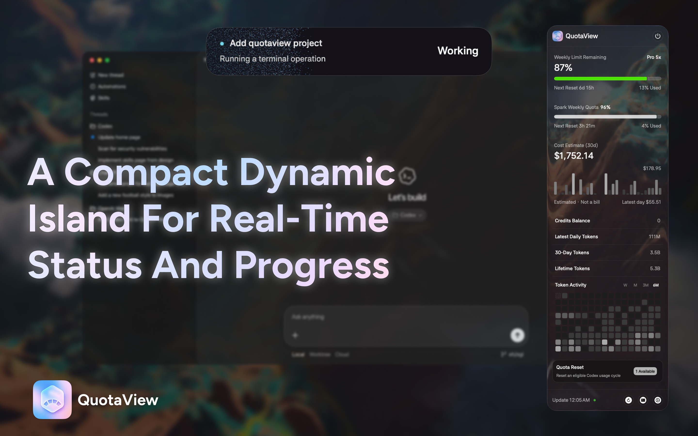
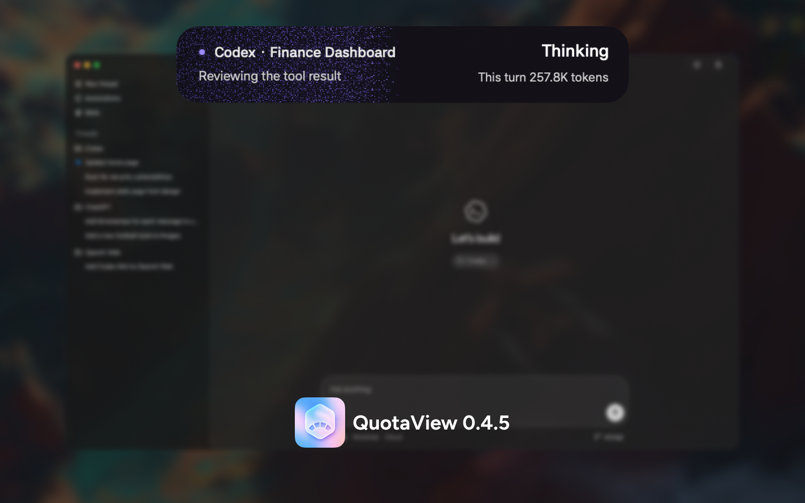
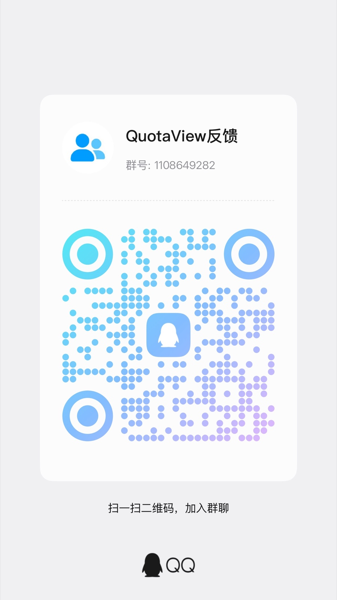

<p align="center">
  
</p>

<h1 align="center">QuotaView · macOS 上的 Codex 灵动岛</h1>

<p align="center">
  让 Codex 工作时始终可见。
</p>

<p align="center">
  实时状态、任务进度、等待确认、本次 Token、完成回执与剩余额度，都在一个原生灵动岛里。
</p>

<p align="center">
  <a href="https://github.com/Duoasa/QuotaView/releases/tag/v0.4.7-build.2"></a>
  <a href="https://github.com/Duoasa/QuotaView/actions/workflows/ci.yml"></a>
  
  
  <a href="LICENSE"></a>
</p>

<p align="center">
  <a href="https://github.com/Duoasa/QuotaView/releases/download/v0.4.7-build.2/QuotaView-v0.4.7-build.2.zip"><strong>下载 QuotaView v0.4.7 Build 2</strong></a>
  ·
  <a href="#快速开始">快速开始</a>
  ·
  <a href="#隐私设计">隐私说明</a>
  ·
  <a href="#从源码构建">从源码构建</a>
</p>

<p align="center">
  <a href="README.md">English</a> · <strong>简体中文</strong>
</p>

<p align="center">
  
</p>

当 Codex 在后台继续工作时，它的状态不应该随着窗口离开前台而消失。QuotaView 把当前任务变成菜单栏下方原生、点击穿透的 **Codex 灵动岛**：正在做什么、计划进度如何、是否等待确认、本轮消耗了多少 Token，以及任务完成后还剩多少额度，都可以直接看到。

QuotaView 开源、轻量，并以本地处理为核心。新版 Codex 首次启动即可使用，无需配置 Hook；额度与用量则保留在菜单面板和原生小组件中，需要时一次点击即可查看。

## 0.4.7 Build 2 更新

自定义代理在公开预览和用户反馈后转为正式功能。在 **设置 → 代理设置** 中开启 HTTP 或 SOCKS5，填写服务器地址和端口，测试连接后保存。默认关闭，支持不带账号密码的代理。

**恢复默认** 可还原原有连接行为。代理用于额度与账户用量查询；灵动岛本地任务桥和当前任务 Token 读取沿用 0.4.6 架构。完成后的显示时长仍可调整，默认 20 秒缩小，再过 100 秒隐藏。

## Codex 灵动岛

灵动岛是 QuotaView 的核心体验，不是额度面板附带的一项功能。

| 任务时刻 | 灵动岛显示什么 |
| --- | --- |
| **思考与执行** | 任务标题、当前操作、实时状态、本次 Token，以及感知进度的量子噪点界面。 |
| **计划任务** | 将已完成、进行中和待处理步骤转化为保守进度；只有任务真实完成才会到达 100%。 |
| **等待确认** | 立即显示等待状态；超过 10 秒后出现黄色描边和光晕，让被阻塞的任务更难错过。 |
| **任务完成** | 最大态变为完成回执：左侧显示本次 Token，右侧显示当前剩余额度。 |
| **缩略完成态** | 隐藏前继续保留“已完成”和小型风险色剩余额度圆环。 |
| **鼠标悬停** | 整个灵动岛进入 80% 透明态并保持点击穿透，让后方内容继续清晰可见。 |

灵动岛可以识别思考、执行、工具调用、等待确认、上下文压缩、完成、中断与失败。它可以跟随 Codex 所在屏幕，支持减少动态效果和深浅色外观，并允许调整任务完成后的收起时序。

<p align="center">
  
</p>

## 新版 Codex，即开即用

QuotaView 0.4.5 为新版 Codex 增加了只读本地任务桥：

- **首次使用无需 Hook。** 打开 QuotaView 后直接开始 Codex 任务，灵动岛会自动发现正在进行的本地工作。
- **状态更新更及时。** 数据桥持续跟随本地任务的追加事件，包括生命周期、计划步骤计数、粗粒度工具类别和 Token 总量。
- **保留安全兼容回退。** 共享本地 App Server 连接和签名 Activity Hook 只为旧环境提供回退路径。
- **不会控制 Codex。** 数据桥只观察已有活动，不会启动、修改或写入 Codex 数据。

## 额度与用量，一次点击

灵动岛负责呈现当前任务，QuotaView 的其他界面负责补全任务之外的信息：

| 界面 | 用途 |
| --- | --- |
| **菜单栏** | 无需打开窗口，持续显示你选择的额度数值或重置倒计时。 |
| **菜单面板** | 查看全部可用 Codex 额度周期、Spark 额度、重置时间、Credits、最近一天与 30 日 Token，以及累计用量。 |
| **Token 活动** | 通过紧凑的单色网格查看每日 Token，并切换一周、一个月、三个月和半年。 |
| **成本估算** | 查看明确标注的本地 30 日估算值；它是估算，不是账单。 |
| **桌面小组件** | 使用原生小号或中号 WidgetKit 小组件查看额度和重置信息。 |
| **应用更新** | 手动检查 Stable 通道，或主动开启每 24 小时一次的原生检查；安装更新始终需要确认。 |

## 快速开始

1. 确认已经安装并登录 ChatGPT 或 Codex。
2. 从 [v0.4.7 Build 2 Release](https://github.com/Duoasa/QuotaView/releases/tag/v0.4.7-build.2) 下载 `QuotaView-v0.4.7-build.2.zip`。
3. 解压后打开 `QuotaView.app`。
4. 开始一个 Codex 任务。新版 Codex 会自动连接，不需要安装 Hook 或重启。

> [!IMPORTANT]
> v0.4.7 Build 2 已使用 Developer ID 证书签名、通过 Apple 公证并完成
> Staple。解压后可以正常打开，不再需要旧版未签名构建使用的 Finder
> 右键打开方式。

Universal 应用支持 macOS 14 或更高版本，同时兼容 Apple 芯片和 Intel Mac。从 Finder 启动后的首次账户请求可能需要 20–30 秒，后续刷新通常会快很多。

## 隐私设计

QuotaView **不会**：

- 抓取 Codex 或 ChatGPT 账户网页；
- 读取、复制或保存 `~/.codex` 中的登录凭据；
- 将提示词、推理、消息、命令、参数、工具输出、Diff 或完成正文带入自身模型或诊断；
- 保存身份认证 Token、Cookie、完整账户响应或原始任务记录。

对于新版 Codex，本地任务桥只会有界读取 `~/.codex/sessions` 内的任务记录，并投影哈希后的会话与 turn 标识、工作区路径最后一级、生命周期状态、计划步骤状态计数、粗粒度工具类别、时间和 Token 数值。签名 Hook 回退遵循相同的脱敏边界。

额度信息通过 JSON-RPC 从本机安装的 `codex app-server` 请求。QuotaView 只在自己的偏好设置域中保存显示偏好、紧凑的可用/错误状态和最近一次成功刷新时间；写入 App Group 供 WidgetKit 使用的快照也经过有界和脱敏处理，不包含凭据、账号标识、完整响应或用量历史。

QuotaView 默认只读。额度重置界面仍是本地安全演示，不会调用 `account/rateLimitResetCredit/consume`。

主 App Target 已关闭 App Sandbox，因为它需要与本机安装的 Codex 服务通信。

## 系统要求与当前范围

- macOS 14 或更高版本
- 已安装并登录 ChatGPT/Codex
- 仅从源码构建时需要 Swift 6 或 Xcode 16+
- 当前稳定版聚焦支持 Codex
- 稳定版灵动岛跟随一个主任务；独立的 [0.3.2 Preview 1](https://github.com/Duoasa/QuotaView/releases/tag/v0.3.2-preview.1) 包含实验性的多任务体验
- 成本数值是本地估算，不是账单记录
- Codex 协议细节可能随安装版本变化，因此 QuotaView 保留兼容回退路径

QuotaView 会按以下顺序查找 Codex 可执行文件：

1. `CODEX_EXECUTABLE`
2. `/Applications/ChatGPT.app/Contents/Resources/codex`
3. `/opt/homebrew/bin/codex`
4. `/usr/local/bin/codex`
5. 当前 `PATH`

## 从源码构建

克隆仓库并运行测试：

```bash
git clone https://github.com/Duoasa/QuotaView.git
cd QuotaView
swift test
```

运行只读额度探针：

```bash
swift run QuotaViewProbe
```

在开发环境中运行应用：

```bash
swift run QuotaView
```

或者构建 Universal 应用和 ZIP：

```bash
chmod +x scripts/build-app.sh
./scripts/build-app.sh
open dist/QuotaView.app
```

构建脚本会优先使用 Developer ID Application 身份，其次使用 Apple Development 身份。如果两者都不可用，会回退到适合本地测试的 ad-hoc 签名。只有 Developer ID Application 构建可以使用公证流程：

```bash
CODESIGN_IDENTITY="Developer ID Application: Name (TEAMID)" \
NOTARY_PROFILE="<keychain-profile>" \
./scripts/build-app.sh
```

使用 Xcode 时，请打开 `QuotaView.xcodeproj`，选择共享的 **QuotaView** Scheme 和 **My Mac**，然后运行或测试。

## 数据来源

初始化后请求额度与用量数据：

```text
initialize
initialized
account/rateLimits/read
account/usage/read  # 仅在 Token 区域开启时请求
```

| QuotaView 数据 | Codex App Server 字段 |
| --- | --- |
| 可用状态 | `rateLimitReachedType`、`spendControlReached`、`primary.usedPercent` |
| 已用额度 | `primary.usedPercent` |
| 剩余额度 | `100 - primary.usedPercent` |
| 重置时间 | `primary.resetsAt` |
| Credits | `credits.balance`、`credits.unlimited` |
| 重置次数 | `rateLimitResetCredits.availableCount` |
| Token | `summary.lifetimeTokens`、`dailyUsageBuckets` |

Credits 与套餐剩余额度是两个独立概念，界面不会将它们合并。

## 项目结构

```text
Sources/
├── QuotaView/                    # SwiftUI 界面、设置与 AppKit 界面层
├── QuotaViewActivityHook/        # 已签名的兼容 Hook Helper
├── QuotaViewActivityHookSupport/ # 共享的脱敏 Hook 协议支持
├── QuotaViewCore/                # 领域模型、数据源、任务桥与刷新
├── QuotaViewFutureContracts/     # 未链接的未来能力契约
├── QuotaViewWidgetContract/      # 有界 WidgetKit 快照契约
├── QuotaViewWidget/              # 原生小号与中号小组件
└── QuotaViewProbe/               # 只读命令行额度探针
Tests/
└── QuotaViewCoreTests/           # 领域、数据桥、生命周期与 App 测试
```

## 发布与项目状态

- **推荐稳定版：** [QuotaView v0.4.7 Build 2](https://github.com/Duoasa/QuotaView/releases/tag/v0.4.7-build.2)
- **自定义代理：** 设置 → 代理设置，支持无账号密码的 HTTP/SOCKS5、连接测试与恢复默认，默认关闭。
- **历史代理预览：** [QuotaView v0.4.7 Preview 1](https://github.com/Duoasa/QuotaView/releases/tag/v0.4.7-preview.1) — 已由正式版 0.4.7 Build 2 替代。
- **实验性多任务预览：** [QuotaView v0.3.2 Preview 1](https://github.com/Duoasa/QuotaView/releases/tag/v0.3.2-preview.1)
- **版本历史与发布验证：** [VERSION_HISTORY.md](VERSION_HISTORY.md)
- **当前工程交接：** [HANDOFF.md](HANDOFF.md)
- **设计与行为规格：** [docs/specs/README.md](docs/specs/README.md)

## 开源与贡献

QuotaView 采用 [MIT 许可证](LICENSE)开源。

欢迎提交 Bug、Codex 兼容性报告和目标明确的功能建议。请先使用 [Issue 模板](https://github.com/Duoasa/QuotaView/issues/new/choose)，准备代码改动前阅读 [规格索引](docs/specs/README.md) 和 [CONTRIBUTING.md](CONTRIBUTING.md)。

请勿在 Issue 中包含身份认证 Token、登录凭据、原始任务记录或未经脱敏的 `~/.codex` 文件。

## 用户反馈社群

遇到问题、发现 Bug，或者有新想法？欢迎加入 QuotaView QQ 反馈群。

**QQ群：1108649282**

<p align="center">
  
</p>
