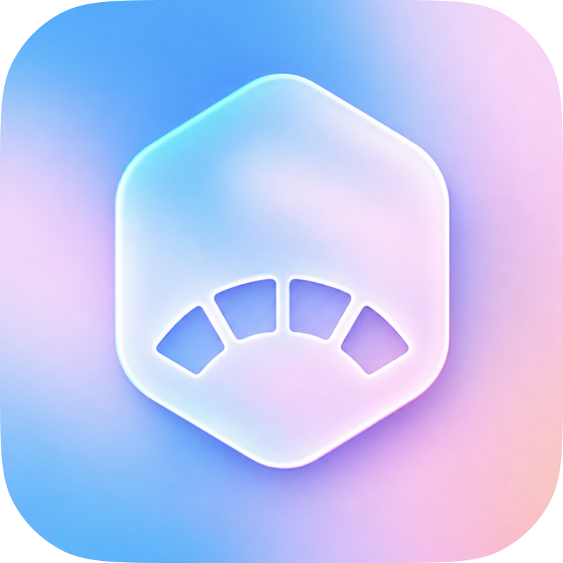
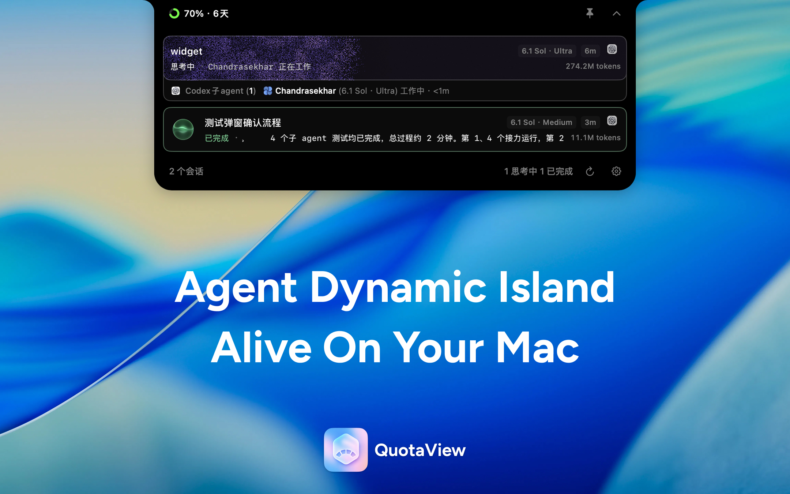
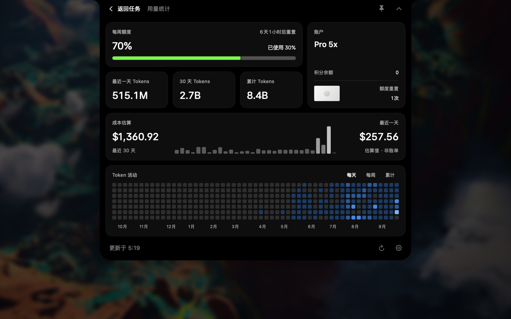
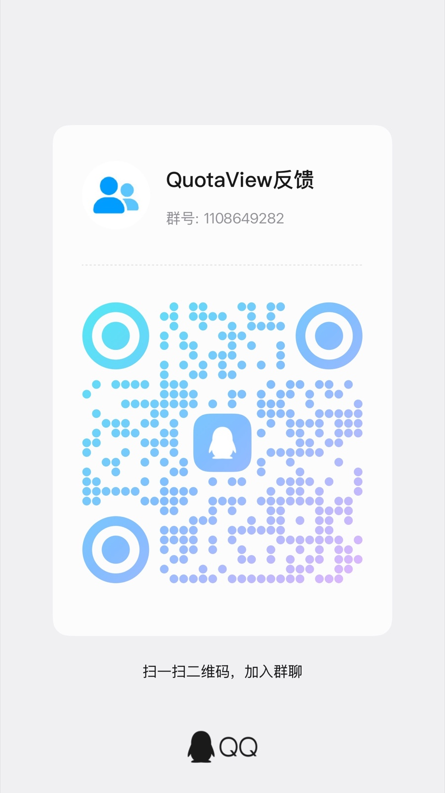

<p align="center">
  
</p>

<h1 align="center">QuotaView · macOS 多 Agent 灵动岛</h1>

<p align="center">
  随时查看编程 Agent 的任务与用量。
</p>

<p align="center">
  实时状态、任务进度、等待确认、本次 Token、完成回执与剩余额度，都在一个原生灵动岛里。
</p>

<p align="center">
  <a href="https://github.com/Duoasa/QuotaView/releases/tag/v0.7.9-build.1"></a>
  <a href="https://github.com/Duoasa/QuotaView/actions/workflows/ci.yml"></a>
  
  
  <a href="LICENSE"></a>
</p>

<p align="center">
  <a href="https://github.com/Duoasa/QuotaView/releases/download/v0.7.9-build.1/QuotaView-v0.7.9-build.1.zip"><strong>下载 QuotaView v0.7.9 Build 1</strong></a>
  ·
  <a href="#快速开始">快速开始</a>
  ·
  <a href="#隐私设计">隐私说明</a>
  ·
  <a href="#从源码构建">从源码构建</a>
</p>

<p align="center">
  <a href="README.md">English</a> · <strong>简体中文</strong>
</p>

<p align="center">
  
</p>

QuotaView 将本地编程任务放进原生 macOS 灵动岛，无需来回切换窗口，即可查看 **Codex、Claude Code、DSH 和 Kimi Code** 的任务状态、支持的确认请求、完成状态与可用的用量信息。

## 0.7.9 更新

- **支持更多 Agent。** 在统一连接列表中管理 Codex、Claude Code、DSH 和 Kimi Code。DSH 同时兼容采用相同接口的定制客户端，支持自动发现与添加数据目录。
- **更多个性化选项。** 调整展开宽度、隐私模式、自动弹出行为及可选用量模块。三种任务特效提供实时预览，不可见时自动暂停。
- **更规整的日常体验。** 优化设置、来源图标、任务切换和 hover 信息。较窄宽度下，成本柱图与 Token 活动支持横向滚动，默认显示最近数据。

## Agent 支持范围

| Agent | 任务与确认 | 用量 |
| --- | --- | --- |
| **Codex** | 自动发现本地任务，可选活动 Hook；支持的确认可在灵动岛处理。 | 可用的账户额度、重置时间、Credits、Tokens 与成本估算。 |
| **Claude Code** | 主动启用 Hook 后显示任务状态及支持的权限请求。 | 本地 Token 历史与成本估算；开启状态栏采集后读取官方额度窗口。 |
| **DSH** | 原生会话插件接收生命周期、工具、压缩和权限提醒；兼容客户端统一显示为 DSH。 | 事件实际提供的任务 Token 数；不提供账户额度与历史成本面板。 |
| **Kimi Code** | Hook 接收生命周期、工具、压缩和权限提醒。 | 不提供账户额度与历史成本面板。 |

DSH 和 Kimi Code 的权限请求在原客户端确认。可用字段取决于 Agent 及其版本，缺失数据保留占位符。DSH、Kimi 接入默认关闭，由用户主动开启。兼容边界见[接入规格](docs/specs/agent-integrations.md)。

## 按习惯调整

- 在菜单栏下查看并行任务及支持的子 Agent。
- 任务列表与用量页展开宽度支持 **560–680 pt**，并按 MacBook 实际刘海保留安全空间。
- 选择**状态烟雾、量子噪点、液态涌浪**，设置中实时预览，支持系统“减少动态效果”。
- 调整隐私、自动展开与通知停留时间。
- 按需显示成本估算、Token 活动，切换每天、每周与累计视图。
- 通过菜单栏和原生桌面小组件快速查看额度。

<p align="center">
  
</p>

## 快速开始

1. 下载 [QuotaView 0.7.9 Build 1](https://github.com/Duoasa/QuotaView/releases/tag/v0.7.9-build.1)，解压并打开 `QuotaView.app`。
2. 在**设置 → 连接**中启用需要的 Agent。
3. Codex 自动发现本地任务。配置 Hook 或 DSH 插件后，按设置提示新建会话或重启对应客户端。

正式包已使用 Developer ID 签名、通过 Apple 公证并完成 Staple。

需要 **macOS 14 或更高版本**。Universal 应用同时支持 Apple 芯片与 Intel Mac；各 Agent 客户端需要单独安装和配置。

应用更新使用 Stable 通道，自动检查可选，安装更新需要确认。

## 隐私设计

任务信息在本地处理，不会上传到 QuotaView 服务，也不收集登录凭据。接入使用本地接口、有界会话记录、Hook 或原生插件。

启用接入可能修改对应客户端配置；修改前保存备份，只管理 QuotaView 自己的标记项。DSH 定制客户端继续使用各自独立的数据目录与会话身份。

成本为估算值，不是账单。额度重置仍是本地演示，不消耗真实重置次数。反馈问题时请勿上传凭据或原始会话记录。

## 从源码构建

```bash
git clone https://github.com/Duoasa/QuotaView.git
cd QuotaView
swift test
swift run QuotaView
```

使用 Swift 6 或兼容的 Xcode 工具链；DSH 插件测试还需要 Node.js。需要完整 App 与小组件时，打开 `QuotaView.xcodeproj`，选择 **QuotaView** Scheme 和 **My Mac** 后运行。

分发包由 `scripts/build-app.sh` 构建。Developer ID 签名与公证需要自己的签名身份、公证配置，以及可恢复的 Sparkle 更新密钥加密备份，详见[发布流程](docs/workflow/RELEASE.md)。

## 项目与反馈

- [当前版本](https://github.com/Duoasa/QuotaView/releases/tag/v0.7.9-build.1) · [上一稳定版 0.7.7](https://github.com/Duoasa/QuotaView/releases/tag/v0.7.7-build.1)
- [版本历史与发布证据](VERSION_HISTORY.md) · [开发交接](HANDOFF.md)
- [设计与行为规格](docs/specs/README.md) · [贡献指南](CONTRIBUTING.md)
- [提交问题](https://github.com/Duoasa/QuotaView/issues/new/choose)，也可从**设置 → Bug 反馈**进入。

采用 [MIT 许可证](LICENSE)开源。

**QQ 反馈群：1108649282**

<p align="center">
  
</p>
