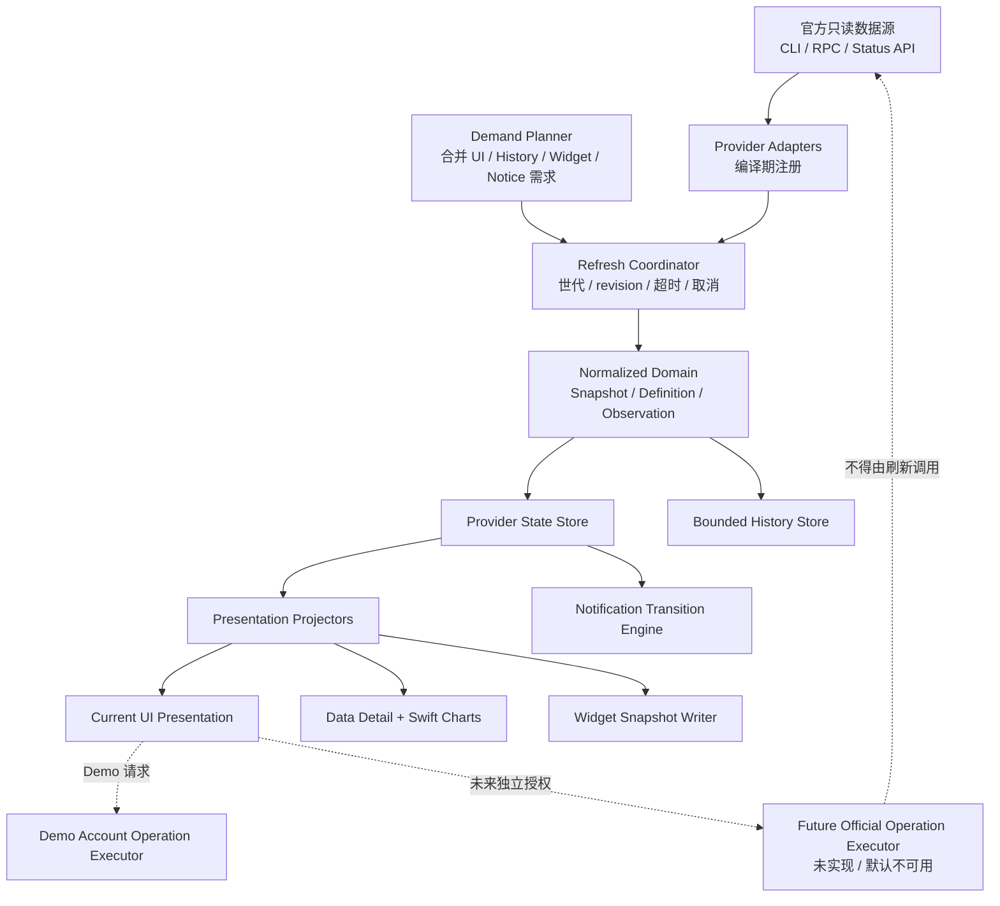

# QuotaView 核心重构执行指导

> 文档编号：`QV-EXEC-CORE-002`
>
> 文档类型：历史架构参考（Archived Architecture Reference）
>
> 规格状态：`Archived`
>
> 交付状态：`Released`（仅 Phase 0–2、4A–4B；Phase 3、5–7 不在已发布范围）
>
> 文档版本：`2.1`
>
> 原始设计基线：QuotaView `0.1.5 (Build 6)`
>
> 当前生产基线：QuotaView `0.3.6 (Build 2)`
>
> 编写日期：2026-07-28
>
> SDD 状态更新：2026-08-04
>
> 适用平台：macOS 14 及以上
>
> 参考实现：CodexBar，固定分析版本
> `dd029db4cb17811edd5805d952c5d5fc23395be3`

## EXEC-00. 文档定位

本文保留早期架构重构的决策、分阶段方案和已发布部分的追溯信息。它不是
当前路线图，也不能单独授权任何未实施 Phase。新的核心架构工作必须建立
当前 Spec，并以生产代码和 [SDD 注册表](../specs/README.md) 为准。

历史范围覆盖：

- 当前 Codex 数据采集可靠性；
- 标准化领域模型；
- 更多数据、历史与图表；
- 设置中的显示配置；
- 多 Provider、模型与 Agent 用量支持；
- 原生 macOS Widget；
- 额度提醒通知；
- 官方账户操作的安全预留；
- 性能、体积、测试、迁移与发布门禁。

本文中已实施的 Phase 只提供追溯依据；尚未实施的 Phase 已归档，不再视为
待办。只有被新的活跃规格明确采纳后才可重新进入开发。

本文档替代本文件此前的 `QV-DESIGN-CORE-001` 内容。原生 Widget 的具体
实现细节继续参考
[`quotaview-widgetkit-solution.md`](./quotaview-widgetkit-solution.md)，
但两份文档冲突时，通用依赖与隐私边界以本文档为准，已发布 Target、路径、
App Group 和构建事实以专项文档的当前生产映射与生产代码为准。

本文档描述“应当怎样实施”，各阶段的实际完成情况以
[`quotaview-core-refactor-0.2.0-report.md`](./quotaview-core-refactor-0.2.0-report.md)
为准。Phase 1–2 的完成不授权当前版本接入真实账户写操作。所有代码、
配置、资源、签名和发布工作仍须遵守项目根目录 `AGENTS.md`。

### EXEC-00.1 当前实施状态

下表是截至 `0.3.3 (Build 3)` 的生产校准结果，优先于本文保留的原始实施
计划时态：

| Phase | 当前状态 | 已发生事实 / 当前边界 |
|---|---|---|
| Phase 0 | 已完成自动化基线 | `0.2.0` 补齐行为测试；当前完整视觉矩阵仍不能由历史结论推导 |
| Phase 1 | 已发布 | `0.2.0` 完成采集可靠性、超时、生命周期与并发收敛 |
| Phase 2 | 已发布 | `0.2.0` 完成 Domain、Provider、兼容投影、Demand 与 Demo 操作边界 |
| Phase 3 | 部分进入生产 | `0.3.3 Build 3` 使用官方每日用量桶提供 Token 活动图表及显示开关；SQLite History、长期本地存储、详情页和通用动态指标仍未交付 |
| Phase 4A | 已发布 | `0.2.0` 建立 `QuotaViewWidgetContract`、快照与纯逻辑测试 |
| Phase 4B | 已发布 | `0.2.1` 发布 Widget Extension；`0.3.1 Build 2` 修复直接分发 App Group |
| Phase 5 | 未开始 | 没有第二个生产 Provider，也没有模型/Agent 生产展示 |
| Phase 6 | 未开始 | 没有生产通知调度或通知设置 |
| Phase 7 | 未授权、未开始 | 额度重置继续为 Demo；不存在真实 consume 路径 |

未开始的 Phase 仍是方向规格，不构成实施授权。`0.3.2 Preview 1` 多任务
灵动岛保留为独立公开预览版和本地归档参照，不包含在 `0.3.3` 稳定生产
源码中；后续继续开发必须建立新的迭代。

---

## EXEC-01. 已确认的产品方向

### EXEC-01.1 产品定位

QuotaView 的定位调整为：

> 一个轻量、原生、默认只读的本地 AI 用量与状态聚合器；只有在用户单独
> 授权、Provider 提供官方方法且安全条件全部满足时，未来版本才允许执行
> 明确范围内的官方账户操作。

“默认只读”与“可选官方操作”必须同时成立：

- 安装、首次启动和升级后始终处于只读状态；
- 数据采集不读取浏览器 Cookie、Keychain 凭据、Token 文件或账户秘密；
- 数据只来自官方本地 CLI、官方 App Server/RPC 或官方状态 API；
- 官方账户操作不属于数据采集，必须位于独立模块；
- 用户打开数据显示、历史、Widget 或通知，不能隐式开启账户操作；
- 用户关闭账户操作后，不得残留执行任务、授权缓存或待执行计划。

### EXEC-01.2 当前版本的写操作边界

当前额度重置功能保持 Demo：

- 保留现有重置入口、详情页、风险说明和玻璃内确认层；
- Demo 可以模拟次数变化和成功反馈，但只存在于展示状态中；
- 不发送任何真实账户写请求；
- 不实现 `account/rateLimitResetCredit/consume`；
- 不读取或保存操作凭据；
- 不创建自动执行定时器；
- 不因“预留接口”而声明真实操作已经可用。

当前生产能力只能报告：

```text
accountOperationAvailability = demoOnly
```

不得报告：

```text
officialManualAvailable
officialAutomaticAvailable
```

### EXEC-01.3 未来账户操作的产品语义

未来若另行批准真实功能，用户侧模式才可以扩展为：

| 模式 | 默认 | 数据读取 | 账户写操作 |
|---|---|---|---|
| `readOnly` | 是 | 官方只读入口 | 禁止 |
| `demo` | 当前可用 | 官方只读入口 | 仅本地模拟 |
| `manualOfficial` | 未来 | 官方只读入口 | 用户逐次确认的官方操作 |
| `automaticOfficial` | 未来独立立项 | 官方只读入口 | 用户预授权规则内的官方操作 |

`manualOfficial` 和 `automaticOfficial` 只是未来语义，不应在当前设置中作为
可选项出现。只有真实官方方法、安全设计、签名版本和用户授权流程都通过
独立评审后，才能进入生产枚举和持久化设置。

### EXEC-01.4 扩展目标

重构后的架构应逐步承载：

1. 更多当前数据和官方返回的历史数据；
2. 本地采样历史与 Swift Charts 图表；
3. 设置中按稳定 ID 选择显示内容；
4. 原生 macOS Widget；
5. 更多符合隐私门槛的 Provider；
6. 模型与 Agent 级聚合用量；
7. 额度阈值、周期重置和数据恢复通知；
8. 官方账户操作协议、能力发现、授权和执行日志的代码结构预留。

这里的“模型与 Agent 支持”指读取和展示官方提供的聚合状态或用量，不表示
QuotaView 负责运行模型、托管 Agent、保存会话内容或读取 Prompt。

---

## EXEC-02. 不变量与非目标

### EXEC-02.1 必须保持的不变量

- 缺失数据不能解释为真实 `0`；
- “可用/不可用”只表示最近一次数据获取是否有效；
- 数据可用性、额度风险和服务健康是三个独立维度；
- 当前主面板、重置页、设置窗口和菜单栏入口的整体视觉效果保持；
- 当前 Asta Sans、Liquid Glass、系统设置表面和功能图标继续使用；
- 当前中文、英文、跟随系统语言与外观切换继续即时生效；
- 当前面板内容开关和动态高度继续生效；
- 当前额度重置页继续是 Demo，不发生真实消耗；
- 禁用的 Provider 或模块不创建后台任务、子进程、数据库写入或通知检查；
- 所有后台任务可取消、可超时、可停止并最终收敛；
- Widget、历史和通知只接受标准化、脱敏数据；
- 重构过程中每个阶段都能独立测试、发布或回滚。

### EXEC-02.2 UI 保持的含义

允许修改：

- Store 与 View 的绑定方式；
- Presentation DTO；
- 设置的内部持久化结构；
- 文件组织和依赖注入；
- 为保持相同视觉所需的最小视图适配。

不得以架构重构为由改变：

- 主面板和重置页的整体几何、层级与玻璃效果；
- 设置窗口的系统表面方向；
- 状态颜色和业务语义；
- 已确认的图标、字体和交互状态；
- 已有按钮功能、路由、快捷键和辅助功能含义。

视觉与交互是否保持由产品所有者运行应用后验收。Codex 只负责代码、状态
逻辑、自动化测试和构建检查，不主动截图或代替用户作视觉结论。

### EXEC-02.3 非目标

- 不做登录器、凭据管理器或 Token 代理；
- 不抓取网页、DOM 或浏览器会话；
- 不建立动态插件市场；
- 不运行用户下载的 Provider 脚本；
- 不引入 WebKit 或大型第三方运行时；
- 不把 Widget 变成独立采集器；
- 不在主面板堆叠完整分析工作台；
- 不为尚未批准的功能提前启动后台服务；
- 不在当前重构中实现真实手动或自动额度重置；
- 不为了“通用”一次性复制 CodexBar 的大规模双注册表和配置体系。

---

## EXEC-03. 0.1.5 历史基线与先修问题

本节记录本文在 `0.1.5 (Build 6)` 编写时观察到的重构前结构与问题，只用于
解释 Phase 1–2 的设计动机，不描述 `0.3.1 (Build 2)` 当前源码。问题的当前
完成状态以 `EXEC-00.1`、生产代码和实施报告为准。

### EXEC-03.1 0.1.5 历史结构

```text
QuotaView
├── QuotaViewCore
│   ├── CodexAppServerClient
│   ├── CodexExecutableLocator
│   └── CodexModels
├── QuotaView
│   ├── CodexStatusStore
│   ├── AppPreferences
│   ├── MenuBarPanelController
│   ├── 主面板、重置页和设置窗口
│   └── App 生命周期
├── QuotaViewProbe
└── QuotaViewTests
```

### EXEC-03.2 0.1.5 当时确认的问题

| 问题 | `0.1.5` 当时表现 | 必须解决的阶段 |
|---|---|---|
| 缺失主窗口被解释为 0 | `usedPercent ?? 0` | Phase 1 |
| 无刷新发布世代 | 旧请求可能覆盖新状态 | Phase 1 |
| 刷新中请求被丢弃 | 手动刷新行为不稳定 | Phase 1 |
| 固定 60 秒循环 | 请求耗时导致节奏漂移 | Phase 1/2 |
| 统一 45 秒超时 | 启动和已连接请求无法分别治理 | Phase 1 |
| stdout 无大小上限 | 异常输出可能无界增长 | Phase 1 |
| AppDelegate 无对称 stop | 退出清理依赖进程自然结束 | Phase 1 |
| Store 职责集中 | 多数据和 Provider 后复杂度失控 | Phase 2 |
| 设置为固定 Bool | 不能自然扩展任意指标 | Phase 3 |
| 当时测试只覆盖少量 Core 行为 | 无法证明 UI 功能完整保留 | Phase 0 起 |

这些问题应渐进修复，不进行一次性重写。

---

## EXEC-04. 目标架构与依赖方向

### EXEC-04.1 总体数据流



### EXEC-04.2 依赖规则

1. Domain 不依赖 SwiftUI、AppKit、WidgetKit、UserNotifications 或 SQLite；
2. Provider 依赖 Domain 协议，不依赖具体 UI；
3. UI 只读取 Presentation，不直接解析 RPC；
4. History 只保存标准化 Observation；
5. Widget Extension 不链接 Provider、Process、History 或操作模块；
6. Notification Transition Engine 是纯值逻辑；
7. Account Operation Executor 不实现 Provider 的只读 `fetch`；
8. Demo Executor 不依赖真实 App Server 写方法；
9. 未实现模块只有类型、协议和无副作用默认实现，不创建后台生命周期；
10. 外层功能不能反向改变 Domain 的隐私语义。

### EXEC-04.3 当前物理组织与原则

当前生产代码继续使用较小、扁平的 `QuotaViewCore`，通过 Target、文件职责
和访问控制建立边界，没有为了文档中的概念层级创建大量空目录：

```text
Sources/
├── QuotaViewCore/
│   ├── DomainModels.swift
│   ├── ProviderArchitecture.swift
│   ├── CodexProviderAdapter.swift
│   ├── RefreshCoordinator.swift
│   └── AccountOperations.swift
├── QuotaView/                     # Presentation、Store、Views、Settings、App
├── QuotaViewFutureContracts/      # 未链接的未来 History/Chart/Notification 契约
├── QuotaViewWidgetContract/       # Foundation-only 共享快照
└── QuotaViewWidget/               # WidgetKit Extension 实现
```

Phase 3、5、6 未实施，因此当前 `QuotaViewCore` 中没有生产 History、Charts、
第二 Provider 或 Notification 子系统。未来实施时可以按职责建立目录，但不得
把 `QuotaViewFutureContracts` 的预留类型视为已交付能力。

只有以下情况才新增 Target：

- Widget Extension 需要真实编译边界；
- 纯 Foundation Widget Contract 需要被 App 与 Extension 共享；
- 测量证明拆分有利于启动、体积或独立测试；
- Xcode Extension-safe 检查要求物理隔离。

不得仅为了目录整洁引入动态 Framework。

---

## EXEC-05. 标准化领域模型

### EXEC-05.1 正交状态

```swift
enum DataAvailability: Equatable, Sendable {
    case available
    case unavailable(reason: UnavailableReason)
}

enum QuotaRisk: Equatable, Sendable {
    case normal
    case warning
    case exhausted
    case unknown
}

enum ServiceHealth: Equatable, Sendable {
    case operational
    case degraded
    case outage
    case unknown
}
```

投影规则：

- 主面板状态标签只读取 `DataAvailability`；
- 进度颜色和额度提醒读取 `QuotaRisk`；
- 服务事故视图读取 `ServiceHealth`；
- 三者不得互相推断；
- 没有有效数据时 `QuotaRisk = .unknown`。

### EXEC-05.2 标识与命名空间

所有 ID 必须稳定、可编码并包含必要命名空间：

```swift
struct ProviderID: Hashable, Codable, Sendable {
    let rawValue: String
}

struct MetricID: Hashable, Codable, Sendable {
    let providerID: ProviderID
    let namespace: String
    let name: String
}

struct EntityID: Hashable, Codable, Sendable {
    let providerID: ProviderID
    let kind: EntityKind
    let rawValue: String
}
```

禁止把模型或 Agent 的裸字符串 ID 当成全局唯一值。

### EXEC-05.3 账户范围

```swift
struct AccountScope: Equatable, Sendable {
    let pseudonymousID: String
    let stability: AccountScopeStability
}

enum AccountScopeStability: Equatable, Sendable {
    case stable
    case currentProcessOnly
    case unavailable
}
```

约束：

- 不保存邮箱、用户名、真实组织 ID 或直接账户 ID；
- 稳定 ID 使用每安装随机盐生成的不可逆伪标识；
- 不把相同原始 ID 映射成跨安装可关联的裸哈希；
- 展示当前数据可以没有稳定账户范围；
- 跨重启历史、通知去重和任何未来账户操作必须要求稳定账户范围；
- 无法安全区分账户时，不得把不同账户的历史静默合并。

### EXEC-05.4 ProviderSnapshot

```swift
struct ProviderSnapshot: Equatable, Sendable {
    let schemaVersion: Int
    let providerID: ProviderID
    let capturedAt: Date
    let availability: DataAvailability
    let accountScope: AccountScope?
    let plan: PlanDescriptor?
    let rateWindows: [RateWindow]
    let balances: [Balance]
    let currentMetrics: [MetricSample]
    let models: [UsageEntity]
    let agents: [UsageEntity]
    let serviceHealth: ServiceHealth
}
```

`capturedAt` 是成功解析快照的时间，不是按钮点击时间。Snapshot 不保存原始
RPC JSON、Token、Cookie、Prompt、代码、文件路径或直接个人身份。

### EXEC-05.5 指标定义

只用 `MetricValue` 不足以安全画图。每个指标必须有定义：

```swift
struct MetricDefinition: Equatable, Sendable {
    let id: MetricID
    let labelKey: String
    let valueKind: MetricValueKind
    let unit: MetricUnit
    let semantic: MetricSemantic
    let allowedAggregations: Set<MetricAggregation>
    let sensitivity: MetricSensitivity
    let defaultDisplayPriority: Int
}

enum MetricSemantic: Equatable, Sendable {
    case gauge
    case intervalTotal
    case cumulativeCounter
    case eventCount
    case state
}
```

用途：

- `gauge` 可以采样趋势；
- `intervalTotal` 按供应商周期显示，不能再求差值；
- `cumulativeCounter` 画区间用量时先计算安全增量；
- 不允许的聚合方式不能由 Chart 层自行猜测；
- 单位、精度和敏感级别在 Provider 转换时确定。

### EXEC-05.6 当前样本与官方历史

当前采样与 Provider 返回的历史桶必须分开表达：

```swift
struct MetricSample: Equatable, Sendable {
    let definitionID: MetricID
    let entity: EntityReference
    let value: MetricValue?
    let availability: DataAvailability
    let observedAt: Date
}

struct MetricObservation: Equatable, Sendable {
    let definitionID: MetricID
    let entity: EntityReference
    let value: MetricValue
    let interval: DateInterval?
    let observedAt: Date
    let receivedAt: Date
    let source: ObservationSource
    let precision: SourcePrecision
}

enum ObservationSource: Equatable, Sendable {
    case sampledSnapshot
    case providerHistoricalBucket
    case derived
}
```

例如 `account/usage/read.dailyUsageBuckets` 应转换成
`providerHistoricalBucket`，按供应商给出的日期去重；不能每次刷新都把
“最近一天 Tokens”作为当前时间的新历史点重复写入。

### EXEC-05.7 ProviderFetchResult

```swift
struct ProviderFetchResult: Equatable, Sendable {
    let snapshot: ProviderSnapshot
    let historicalObservations: [MetricObservation]
    let diagnostics: SanitizedFetchDiagnostics
}
```

主快照成功与可选历史/enrichment 失败可以分别表达。可选数据失败不能把
有效的主额度变成失败；新的成功结果也不能继续携带上一次的旧可选数据。

### EXEC-05.8 错误模型

```swift
enum ProviderError: Error, Equatable, Sendable {
    case unavailable
    case notConfigured
    case timedOut(stage: ProviderStage)
    case processExited(code: Int32?)
    case protocolViolation
    case unsupportedSchema
    case permissionDenied
    case cancelled
    case transient(SanitizedErrorSummary)
}
```

不得使用可能携带原始响应或 stderr 的自由字符串作为可持久化错误。详细
调试信息必须先脱敏并有大小上限。

---

## EXEC-06. Provider 与能力规划

### EXEC-06.1 Provider 协议

```swift
protocol UsageProviderAdapter: Sendable {
    var descriptor: ProviderDescriptor { get }

    func availability() async -> ProviderAvailability
    func fetch(_ request: ProviderFetchRequest) async throws
        -> ProviderFetchResult
    func stop() async
}
```

`ProviderFetchRequest` 至少包含：

- Provider generation；
- enablement revision；
- config revision；
- 请求原因；
- 截止时间；
- 请求的能力集合；
- 当前已知的账户范围期望；
- 取消状态；
- 脱敏关联 ID；
- 不包含凭据。

### EXEC-06.2 ProviderDescriptor

```swift
struct ProviderDescriptor: Sendable {
    let id: ProviderID
    let displayNameKey: String
    let capabilities: ProviderCapabilities
    let sourceKinds: Set<OfficialSourceKind>
    let resourceProfile: ProviderResourceProfile
    let supportsStableAccountScope: Bool
}
```

`ProviderResourceProfile` 用于声明：

- 最短刷新间隔；
- 是否启动子进程；
- 典型超时；
- 是否允许并行 enrichment；
- 低功耗模式下的最低频率；
- 禁用后需要清理的资源。

### EXEC-06.3 接入门槛

新增 Provider 必须全部满足：

1. 使用官方本地 CLI、官方 App Server/RPC 或官方状态 API；
2. 数据读取路径为只读；
3. QuotaView 不读取 Cookie、Keychain、Token 文件或环境秘密；
4. 不使用私有网页、DOM 或 WebKit 抓取；
5. 能定义超时、取消和资源清理；
6. 能分离数据可用性、额度风险和服务健康；
7. 能生成标准化、脱敏数据；
8. 禁用后不产生任务、进程或定时 I/O；
9. 能在不访问真实账户的测试环境中验证；
10. Provider 不支持的数据保持缺失，不推算或伪造。

因此，架构支持“更多符合门槛的 Provider”，但不承诺覆盖所有大模型服务。

### EXEC-06.4 静态注册

首阶段只有 Codex Provider，不建立通用 Registry。第二个真实 Provider
通过门槛后再添加：

```swift
struct ProviderRegistry {
    let providers: [ProviderID: any UsageProviderAdapter]
}
```

注册发生在编译期：

- 不动态加载 bundle；
- 不执行用户脚本；
- 不让 Provider 注入任意 SwiftUI；
- 设置和展示由统一 descriptor/catalog 驱动；
- 被关闭的 Provider 不实例化后台生命周期。

### EXEC-06.5 Demand Planner

显示开关与采集需求不是同一个概念。需求由多个消费者合并：

```swift
struct ConsumerDemand: Sendable {
    let consumer: DataConsumer
    let providerID: ProviderID
    let capabilities: ProviderCapabilities
    let freshness: FreshnessRequirement
}
```

消费者包括：

- 主面板；
- 数据详情；
- History；
- Widget；
- Notifications。

合并规则：

- 指标在主面板隐藏，但 Widget 仍显示时，仍需采集；
- History 关闭且没有其他消费者时，不请求历史能力；
- Provider 总开关关闭时，所有需求归零并停止 Provider；
- 未来账户操作不进入普通 Demand Planner；
- 合并后的能力集合写入刷新发布资格，旧能力请求不能覆盖新配置。

---

## EXEC-07. 刷新协调器与生命周期

### EXEC-07.1 Provider 状态

```swift
enum ProviderLoadState: Equatable, Sendable {
    case idle(lastSnapshot: ProviderSnapshot?)
    case refreshing(previous: ProviderSnapshot?)
    case available(ProviderSnapshot)
    case unavailable(previous: ProviderSnapshot?, error: ProviderError)
}

struct ApplicationDataState: Equatable, Sendable {
    var providers: [ProviderID: ProviderLoadState]
}
```

QuotaView 当前 UI 继续执行：

- 最新请求成功：状态标签可用；
- 最新请求失败：状态标签不可用，主要值显示破折号；
- `previous` 只供诊断、历史连续性或未来显式“上次数据”界面使用；
- `previous` 不能冒充当前有效数据。

### EXEC-07.2 发布资格

每个请求捕获不可变 Publication Context：

```swift
struct PublicationContext: Equatable, Sendable {
    let providerID: ProviderID
    let generation: UInt64
    let enablementRevision: UInt64
    let configurationRevision: UInt64
    let requestedCapabilities: ProviderCapabilities
    let expectedAccountScope: String?
}
```

结果发布前逐项比较：

- Provider 仍启用；
- generation 未变化；
- 配置 revision 未变化；
- 能力需求未变化；
- 账户范围未变化；
- Coordinator 未停止。

只调用 `Task.cancel()` 不足以保证旧 Process 或 callback 不返回，因此
Publication Context 是强制的第二道防线。

### EXEC-07.3 合并与替换

| 请求 | 策略 |
|---|---|
| 启动刷新 | 无有效缓存时立即 |
| 面板打开 | 缓存超过短 TTL 时异步刷新 |
| 手动刷新 | 替换普通刷新，或登记完成后再刷新一次 |
| 普通后台 | 同级请求合并 |
| Provider/设置变化 | 取消旧世代并立即刷新 |
| 系统唤醒 | 数据失效时刷新 |
| 周期重置边界 | 重置后触发一次刷新 |

手动刷新不得静默丢弃。不能安全取消底层请求时，使用
`refreshAfterCurrent`，当前请求结束后再执行一次。

### EXEC-07.4 进程与协议安全

Codex App Server Client 必须具备：

- 明确 `start/stop`；
- App 退出时调用 `stop`；
- 启动与普通请求分离 timeout；
- stdout/stderr 有界行缓冲；
- 最大消息大小；
- 请求 ID 与连接世代绑定；
- 请求写入串行化；
- 取消后清理 continuation；
- 超时或协议失步后终止并重建连接；
- Provider 禁用和账户变化时清理旧连接；
- 日志脱敏；
- 无孤儿子进程。

是否加入 `-s read-only -a untrusted` 启动参数，应先验证 QuotaView 支持的
Codex 版本，不能直接照搬 CodexBar 常数。

### EXEC-07.5 调度原则

建议初始策略：

| 状态 | 间隔 |
|---|---:|
| 面板打开且缓存较旧 | 立即 |
| 最近有交互 | 1–2 分钟 |
| 普通后台 | 5 分钟 |
| 长时间空闲 | 15 分钟 |
| Low Power / 热压力 | 30 分钟 |
| 明确重置时间 | 重置后约 1 秒请求 |

这些时间是请求建议，不是系统级保证。定时器以计划 tick 为锚，避免
“请求耗时 + 固定 sleep”产生持续漂移。

### EXEC-07.6 并发预算

- 同一 Provider 默认一个活跃采集；
- 全局 Provider 子进程最多 `1–2` 个；
- History 写入串行化；
- 图表查询不在 MainActor；
- Widget 不启动 Provider；
- 操作请求不复用只读刷新的重试策略；
- Provider 之间必须隔离失败，单个慢 Provider 不阻止其他结果发布。

---

## EXEC-08. 历史、图表与设置

### EXEC-08.1 History Schema

使用系统 SQLite3，不引入第三方 ORM。建议最小结构：

```text
metric_definitions
├── metric_id
├── provider_id
├── semantic
├── unit
└── schema_version

metric_observations
├── provider_id
├── account_scope_id
├── entity_kind
├── entity_id
├── metric_id
├── interval_start
├── interval_end
├── observed_at
├── received_at
├── source_kind
├── numeric_value
├── value_unit
├── precision
└── schema_version
```

唯一键根据来源区分：

- Provider 历史桶：账户 + entity + metric + interval；
- 本地采样：账户 + entity + metric + 时间桶；
- derived：输入版本 + 派生算法版本 + 时间桶。

### EXEC-08.2 存储边界

禁止保存：

- 原始 RPC/HTTP 响应；
- Prompt、会话正文、代码和文件路径；
- Token、Cookie、Keychain 引用；
- 真实账户 ID；
- 操作授权或原始操作载荷；
- 不参与图表、通知或诊断的高基数字符串。

数据库要求：

- 文件和 WAL/SHM 权限最小化；
- 有 schema migration；
- 损坏时当前状态仍可显示；
- 可从设置中清除历史；
- Provider 禁用后停止写入；
- 达到大小上限时优先删除最旧高精度数据。

### EXEC-08.3 保留与降采样

初始候选策略：

| 数据年龄 | 最大精度 |
|---|---|
| 0–7 天 | 每 5 分钟一个本地采样 |
| 8–90 天 | 每小时一个聚合样本 |
| 90 天以上 | 每天一个聚合样本 |

默认保留期和数据库 MB 上限在 Phase 3 用真实数据量确定。建议先以
`32 MB` 作为测试候选、`64 MB` 作为阻断测试上限，不在测量前固化为产品
承诺。清理和降采样使用批处理，不在每次刷新执行 `VACUUM`。

### EXEC-08.4 Chart Catalog

```swift
struct ChartDescriptor: Identifiable, Sendable {
    let id: ChartID
    let titleKey: String
    let requiredMetricIDs: Set<MetricID>
    let supportedEntityKinds: Set<EntityKind>
    let preferredAggregation: MetricAggregation
    let maximumPointCount: Int
}
```

规则：

- 使用 Swift Charts；
- Chart 查询只返回有限点数；
- Query 层根据 MetricDefinition 决定聚合；
- 不在 View 中临时计算 cumulative counter 差值；
- 不在主菜单面板放复杂图表；
- 详情页使用系统字体和语义表面；
- Provider 不支持的图表不显示开关。

### EXEC-08.5 Display Preferences

```swift
struct DisplayPreferences: Codable, Sendable {
    let schemaVersion: Int
    var enabledProviders: Set<ProviderID>
    var panelMetricIDs: [MetricID]
    var visibleChartIDs: [ChartID]
    var menuBarMetricIDs: [MetricID]
    var widgetMetricIDs: [MetricID]
}
```

必须提供从现有 Bool 设置的迁移：

| 现有设置 | 新稳定 ID |
|---|---|
| `showUsageSummary` | Codex 主额度概览 |
| `showNextReset` | Codex 主周期重置时间 |
| `showCreditBalance` | Codex Credits 余额 |
| `showDailyTokens` | Codex 最近日 Tokens |
| `showLifetimeTokens` | Codex 累计 Tokens |
| `showResetAction` | Demo 重置入口显示偏好 |

迁移要求：

- 只执行一次；
- 保留用户原选择；
- 未知 ID 原样保留但不渲染；
- 不改变现有默认值；
- 菜单栏仍至少保留一项；
- 迁移失败使用当前默认并保留旧 key，不能破坏启动。

### EXEC-08.6 UI Presentation

重构期间先提供兼容 DTO：

```text
ProviderLoadState
    ↓
CurrentCodexPresentationProjector
    ↓
CurrentCodexPresentation
    ↓
现有主面板 / 重置页 / 设置 / 菜单栏
```

Projector 负责：

- 当前 Codex 主窗口；
- plan、已用/剩余百分比；
- 重置时间、余额、Tokens、重置次数；
- 数据不可用时的 `nil`/破折号；
- 额度风险；
- 数字动画需要的稳定 ID；
- 当前 UI 需要的显示顺序。

在新 Domain、设置迁移和行为测试稳定前，不让现有主面板直接消费通用
`[MetricSample]`。

---

## EXEC-09. 通知

### EXEC-09.1 纯状态跃迁

```swift
struct NotificationTransitionEngine {
    func events(
        from old: ProviderSnapshot?,
        to new: ProviderSnapshot,
        preferences: NotificationPreferences
    ) -> [QuotaNotificationEvent]
}
```

引擎不调用 `UNUserNotificationCenter`，不读磁盘，使用显式 `now` 和
Calendar，便于测试。

### EXEC-09.2 持久化通知状态

仅有去重键不够，必须增加 `NotificationStateStore`：

```swift
struct NotificationCycleState: Codable, Sendable {
    let providerID: ProviderID
    let accountScopeID: String
    let windowID: String
    let cycleID: String
    var deliveredEventKeys: Set<String>
    var unavailableSince: Date?
    var lastSuccessfulAt: Date?
}
```

用途：

- 应用重启后不重复通知；
- 保存每周期已穿越阈值；
- 判断长时间不可用后的恢复；
- 周期切换时清理旧状态；
- 账户或 Provider 变化时隔离；
- 没有稳定账户范围时不做跨重启阈值去重。

### EXEC-09.3 支持事件

- 剩余额度下穿用户阈值；
- 窗口耗尽；
- 周期重置；
- 长时间不可用后恢复；
- 服务健康从正常变为降级/故障；
- 未来官方操作成功、失败或结果不确定；
- 未来自动规则被安全条件阻止。

### EXEC-09.4 权限与运行边界

- 用户首次开启通知时再申请系统权限；
- 未授权时数据刷新不受影响；
- Widget 不负责额度通知；
- 应用退出、Mac 睡眠或系统延迟调度时不能承诺精确时刻；
- 系统唤醒后根据最新快照重新判断，不补发已失去意义的旧阈值通知；
- Launch at Login 只能提高应用可用性，不能宣称系统会永久保持进程运行；
- 当前阶段先预留 Scheduler 协议，不提前增加 helper 或 LaunchAgent。

---

## EXEC-10. Widget 执行边界

### EXEC-10.1 采用的成熟方案

```text
Provider
  → QuotaView 主应用
  → WidgetSnapshotProjector
  → App Group 原子 JSON
  → Widget Extension 读取
  → WidgetKit Timeline
```

首版：

- 一个 Usage Widget；
- Small 和 Medium；
- `StaticConfiguration`；
- 系统 Widget 容器与语义表面，配合已确认的 Asta Sans 数据排版；
- 无 Provider、历史和操作能力；
- 只打包 Widget 使用的 Asta Sans 与专用资源，不复制完整主应用资源；
- 无主面板 Liquid Glass 复制。

### EXEC-10.2 必须修正的 Target 边界

```text
QuotaViewWidgetContract
├── Snapshot DTO
├── Codable codec
├── schema compatibility
├── schedule constants
└── Widget 文案

QuotaView App
├── WidgetSnapshotProjector
└── WidgetSnapshotWriter

Widget Extension
├── WidgetSnapshotReader
├── Timeline Provider
└── Views
```

规则：

- Contract 只依赖 Foundation；
- Projector 位于主应用侧，可读取 Domain；
- Extension 不依赖 `QuotaViewCore`；
- Writer API 不编译进 Extension；
- Extension 源码不包含 `Process`、SQLite、网络、Keychain 或账户操作；
- App Group entitlement 在系统层允许共享容器访问，所谓“Extension
  只读”还必须通过代码 Target 分离和静态检查实现，不能只靠约定。

### EXEC-10.3 快照

首版快照目标小于 `16 KB`，硬上限 `64 KB`。包含：

- schema version；
- generated/expires/updated 时间；
- locale；
- 数据可用性；
- Provider 显示名；
- 主额度窗口；
- 最多两个辅助指标；
- 可选 plan 与重置次数。

不包含：

- 原始 ProviderSnapshot；
- 账户标识；
- 历史数据库；
- Prompt、会话、代码；
- 操作授权、规则或审计；
- 凭据或原始响应。

### EXEC-10.4 多 Provider 预留

首版只显示一个当前 Provider，但 schema 演进必须预留两种可选方案之一：

1. 一个快照内包含多个有限 `ProviderWidgetPayload`；
2. 每个 Provider 一个有界文件，由 manifest 列出。

未来 `AppIntentConfiguration` 不能在只有单 Provider payload 时声称支持
多 Provider 选择。采用哪一种在第二 Provider 稳定后决定。

### EXEC-10.5 当前签名与 App Group 生产配置

`0.3.1 (Build 2)` 已使用以下确定值完成 Developer ID 直接分发、Apple
公证、Staple 和真实共享容器验证：

```text
DEVELOPMENT_TEAM = BUUH229D5Q
主应用 Bundle ID = com.quotaview.menubar
Widget Bundle ID = com.quotaview.menubar.widget
App Group = BUUH229D5Q.com.quotaview.shared
```

唯一配置源位于 `Configs/Shared.xcconfig`、`Configs/App.xcconfig`、
`Configs/Widget.xcconfig`，两侧 entitlement 分别位于
`Support/QuotaView.entitlements` 和 `Support/QuotaViewWidget.entitlements`。
主应用保持非 Sandbox，Extension 启用 App Sandbox；不得为了共享容器改变
这一既有发布边界。

Developer ID 直接分发包未嵌入 provisioning profile，因此不能恢复 Build 1
使用过的 `group.com.quotaview.shared`。后续若修改 Team、Bundle ID 或 App
Group，必须作为发布配置变更重新完成签名、共享容器、系统发现、公证、安装
和回下载验证。

### EXEC-10.6 Widget 调度边界

- Timeline entry 不低于约 5 分钟间隔；
- 普通检查建议 15–30 分钟；
- `reloadTimelines(ofKind:)` 只在展示签名变化时调用；
- WidgetKit 可以合并、延迟或忽略建议刷新；
- Widget 不静默拉起主应用；
- 重置后的 timeline entry 必须把旧周期显示为过期/不可用，不能继续显示
  旧百分比；
- 主应用未运行时，Widget 只展示未过期快照，过期后诚实显示不可用。

---

## EXEC-11. 官方账户操作预留

### EXEC-11.1 当前实现范围

本轮重构只预留：

- 能力描述；
- 请求和结果值类型；
- Preflight 协议；
- Executor 协议；
- Demo Executor；
- 不可用 Executor；
- 测试替身。

本轮不实现：

- 真实 App Server 写方法；
- 真实手动执行器；
- 自动规则调度；
- 账户操作数据库；
- 操作授权持久化；
- 自动重试；
- Widget 操作按钮。

### EXEC-11.2 能力状态

```swift
enum AccountOperationAvailability: Equatable, Sendable {
    case unavailable(reason: OperationUnavailableReason)
    case demoOnly
    case officialManual(descriptor: OfficialOperationDescriptor)
    case officialAutomatic(descriptor: OfficialOperationDescriptor)
}
```

当前 Codex Adapter 固定投影 `.demoOnly`。只有未来真实实现通过独立发布
门禁后，才允许返回后两种状态。

### EXEC-11.3 预留协议

```swift
protocol QuotaActionPreflighting: Sendable {
    func preflight(_ request: QuotaActionRequest) async -> ActionPreflight
}

protocol QuotaActionExecutor: Sendable {
    func execute(
        _ request: QuotaActionRequest,
        authorization: ActionAuthorization
    ) async -> QuotaActionResult
}

enum ActionAuthorization: Sendable {
    case demo
    case manual(OneShotAuthorization)
    case automatic(AutomaticRuleGrant)
}
```

当前只有 `.demo` 可以到达 `DemoQuotaActionExecutor`。其他分支默认由
`UnavailableQuotaActionExecutor` 拒绝。

### EXEC-11.4 Demo Executor

Demo Executor：

- 只返回本地模拟结果；
- 不持有 `CodexAppServerClient`；
- 不发起网络、RPC 或 Process；
- 不修改 ProviderSnapshot；
- Demo 后的次数变化只存在于当前确认流程的展示模型；
- 下一次真实只读刷新仍以官方状态为准；
- 明确标记 `isSimulation = true`。

### EXEC-11.5 未来真实操作的强制门槛

未来真实手动或自动操作必须另行设计并同时满足：

1. 用户已单独开启对应模式；
2. Provider 声明官方操作能力；
3. 使用官方 App Server 方法；
4. 不读取凭据；
5. 有稳定脱敏账户范围；
6. 最新数据未过期；
7. 账户、窗口和周期与授权绑定；
8. 可用次数大于零；
9. 有周期最大执行次数；
10. 有全局 Kill Switch；
11. 有持久化操作状态机；
12. 有官方幂等键或等价的唯一执行保障；
13. 超时/断连结果不确定时不自动重试；
14. 重启和唤醒后先核对结果；
15. 有独立通知和脱敏审计；
16. 已取得当前任务中的明确实施授权。

### EXEC-11.6 未来自动操作状态机

自动功能真正立项时，至少需要：

```text
planned
  → executing
    → succeeded
    → rejected
    → failedSafe
    → outcomeUnknown
```

执行前先持久化 `executing` 和幂等 ID。进程在调用后、记录结果前崩溃时，
重启必须进入核对流程，不能重新消费。Provider 没有安全幂等能力时，不得
开放自动模式。

自动授权是可撤销、有范围、有期限的规则授权，不等于“本次交互产生的一次性
确认”。手动和自动授权必须使用不同类型，不能共用一个布尔值。

---

## EXEC-12. 性能、体积与资源预算

### EXEC-12.1 原则

- 优先系统框架和现有 Swift；
- 不引入第三方 ORM、图表、HTTP 或依赖注入框架；
- 不使用 WebKit；
- 不扫描无关进程或目录；
- Disabled means no work；
- Widget 不采集；
- History 有界；
- 图表懒加载；
- 未实现模块无后台生命周期；
- Provider 子进程有并发、时间和输出上限。

### EXEC-12.2 Phase 0 必须记录的基线

- Release `.app` 未压缩大小；
- ZIP 大小；
- 主可执行文件和 Framework 大小；
- 首次面板打开耗时；
- 空闲 15 分钟平均/峰值 CPU；
- 空闲唤醒次数；
- 常驻内存；
- 一次成功刷新耗时；
- 一次失败/超时的资源回收时间；
- 活跃子进程数量。

### EXEC-12.3 回归门禁

Phase 0 记录基线后，将具体数值写入同阶段测试报告。后续阶段默认门禁：

- 安装包或 ZIP 增长超过 15% 必须单独解释并取得确认；
- 空闲内存不得无解释增加超过 10 MB；
- 空闲 CPU 和唤醒次数不得因关闭的功能增长；
- Provider 禁用后 30 秒内相关任务和进程归零；
- Widget 快照目标 `<16 KB`，硬上限 `<64 KB`；
- History 达到上限后能自动收敛；
- Detail/Charts 未打开时不加载大范围查询；
- Extension 大小、App 大小和共享代码重复量分别报告。

如果真实系统框架或 Universal 构建导致某项无法满足，应先给出测量和替代
方案，再调整门槛，不能静默接受。

---

## EXEC-13. 分阶段实施

以下各节保留原始工作项和退出标准，用于追溯及后续未实施阶段。完成情况
必须读取 `EXEC-00.1`，不能从这里的命令式或未来时态推断当前状态。

### Phase 0：行为、性能和 UI 契约

工作：

- 记录当前功能映射和性能/体积基线；
- 为有效、不可用、刷新中、无重置次数和 Demo 确认补行为测试；
- 为现有设置默认值和持久化 key 补迁移 fixture；
- 明确当前 Presentation DTO；
- 记录主面板、重置页和设置窗口不应变化的可见行为；
- 不修改生产逻辑。

退出标准：

- 当前功能有自动化行为基线；
- 性能和体积有可重复测量结果；
- 视觉结果标记“等待用户验收”；
- 无截图、自动展开、自动点击或 UI QA 入口。

### Phase 1：采集可靠性

工作：

- 修复缺失主窗口被解释为 0；
- typed errors；
- bounded line/message buffer；
- 启动/普通请求 timeout 分离；
- generation 和 Publication Context；
- replace/coalesce/refresh-after-current；
- App 退出、Provider 禁用和超时时 stop；
- 假 App Server 并发、慢响应、超长行和协议失步测试。

退出标准：

- 旧请求不能覆盖新请求；
- 手动刷新不丢失；
- 缺失值显示破折号；
- 无孤儿进程和 continuation；
- 当前 UI/功能不变。

### Phase 2：Domain、Provider 和兼容投影

工作：

- 引入 ID、三维状态、MetricDefinition、Sample 和 Observation；
- `CodexProviderAdapter` 包装现有 Client；
- daily buckets 转换为 Provider 历史 Observation；
- 增加 `CurrentCodexPresentationProjector`；
- Store 改为 Provider 状态映射；
- 建立 Demand Planner 最小实现；
- 增加 Account Operation 协议和 Demo/Unavailable Executor；
- 不实现真实账户操作。

退出标准：

- Core Domain 不依赖 UI；
- 当前 Codex UI 只读取兼容 Presentation；
- 现有功能行为测试全部通过；
- Demo 流程无任何真实写路径；
- 尚未加入第二 Provider。

### Phase 3：History、Charts 与动态设置

工作：

- SQLite3 schema、migration 和边界；
- 区分本地采样与官方历史桶；
- 保留、降采样、去重和大小上限；
- Metric/Chart Catalog；
- 独立 Data Detail + Swift Charts；
- 迁移现有 Bool 设置到稳定 ID；
- 设置中增加指标和图表显示选择。

退出标准：

- 数据失败不写 0；
- 模型/Agent 维度可正确落库；
- 查询点数有上限且不阻塞 MainActor；
- History 关闭后无写入；
- 旧用户设置保留；
- 主面板整体视觉保持。

### Phase 4A：Widget 纯协议预留

不依赖 Apple Developer 审批：

- 建立 `QuotaViewWidgetContract`；
- 快照 DTO、codec、schema、过期和大小检查；
- 主应用 Projector；
- 临时目录 Writer/Reader 测试；
- 不要求真实 entitlement；
- 不把 ProviderLoadState 放进 Contract。

退出标准：

- 快照不含敏感字段；
- Extension-safe Contract 无 Core/Process 依赖；
- 损坏、过期、未知版本和缺失值测试通过；
- 未修改当前 UI。

### Phase 4B：签名 Widget Extension

本阶段已在 `0.2.1` 完成，并在 `0.3.1 (Build 2)` 校准共享容器。原始工作项：

- 注册 App Group 和 Widget Bundle ID；
- 添加 Extension Target；
- 配置两侧 entitlement；
- Small/Medium StaticConfiguration；
- 嵌入、Universal 架构和嵌套签名；
- 扩展 `build-app.sh`；
- 在签名构建上验证真实共享容器。

退出标准：

- Extension 不链接 Provider、History 或操作模块；
- 主 App 原子写入，Extension 代码只读；
- App Group、版本、Bundle、架构和签名一致；
- 系统能发现 Widget；
- 视觉与交互等待用户验收。

### Phase 5：第二 Provider、模型与 Agent

工作：

- 对候选 Provider 执行 `EXEC-06.3` 门槛评审；
- 第二个 Provider 通过后建立静态 Registry；
- Provider 独立状态、调度、超时和失败；
- 模型/Agent Entity 与 Metric 映射；
- 设置和 Data Detail 使用通用 Catalog；
- 需要时再评估 Widget 多 Provider schema。

退出标准：

- 禁用 Provider 零任务；
- Provider 失败互不污染；
- ID 有 Provider 命名空间；
- 未知模型/Agent 不崩溃；
- 无 Provider 名称硬编码的通用展示分支；
- 不读取任何凭据。

### Phase 6：通知

工作：

- Transition Engine；
- NotificationStateStore；
- 阈值、周期和恢复去重；
- 权限流程；
- 勿扰与敏感值设置；
- 系统唤醒后的重新判断；
- 可选 Launch at Login 设置另行评审。

退出标准：

- 跨重启不重复轰炸；
- 刷新失败不触发额度归零通知；
- 无权限时应用稳定；
- 关闭通知后无检查任务；
- 不承诺系统无法保证的精确执行时间。

### Phase 7：真实官方账户操作，当前不实施

启动条件：

- 产品所有者明确立项；
- 官方方法、协议和条款重新核对；
- 手动/自动范围明确；
- 稳定账户范围和幂等保障成立；
- 独立安全设计通过；
- Apple 签名与发布路径稳定；
- 当前任务明确授权实施。

未满足全部条件时，Phase 7 保持未开始，当前 Demo 不受影响。

### 阶段总原则

- 一个 Phase 不同时引入多个高风险边界；
- 先兼容投影，再替换底层；
- UI 重绑和新数据功能分开；
- Widget、第二 Provider、通知和真实操作不在同一版本首次上线；
- 每阶段可回滚；
- 每阶段保持已实现功能。

---

## EXEC-14. 当前功能兼容清单

每个 Phase 都必须验证：

| 当前功能 | 必须保持 |
|---|---|
| Codex rate limit | 已用、剩余、重置时间语义不变 |
| Credits | 余额与无数据占位不变 |
| Reset credits | 真实次数展示，入口条件不变 |
| Demo reset | 页面、警告、确认和无真实调用 |
| Token usage | 最近日与累计值不丢失 |
| 数据可用标签 | 只表示最新请求是否成功 |
| 菜单栏 | 图标、剩余、倒计时至少一项 |
| 面板开关 | 隐藏后动态缩短，无空白 |
| 外观 | 浅色、深色、跟随系统 |
| 材质 | 磨砂、清透 |
| 语言 | 简体中文、English、跟随系统 |
| 设置窗口 | 系统表面、原生控件和现有导航 |
| 重置页路由 | 次数失效或设置关闭时自动返回 |
| 辅助功能 | Help、Label、Escape、Reduce Motion |

---

## EXEC-15. 测试与验证

### EXEC-15.1 单元测试

- MetricDefinition 与聚合约束；
- 当前 Sample 与官方历史 Observation；
- Provider/Entity/Metric ID 命名空间；
- 三维状态不互相污染；
- 缺失值不变 0；
- Publication Context 全字段；
- replace/coalesce/cancel/stop；
- timeout、超长行、协议失步；
- Demand Planner 多消费者合并；
- DisplayPreferences 旧 key 迁移；
- History 去重、降采样、上限和 migration；
- Chart 最大点数；
- Notification 跨阈值和跨重启去重；
- Widget schema、过期、大小和敏感字段扫描；
- Demo Executor 无 I/O；
- 非 Demo Authorization 当前全部拒绝。

### EXEC-15.2 集成测试

- 本地假 App Server，不访问真实账户；
- 慢响应、乱序、部分字段和未知字段；
- Provider 开关与能力需求变化；
- 账户范围变化时拒绝旧结果；
- App 退出后无子进程；
- 数据库不可写时当前状态仍显示；
- Widget 快照不含敏感字段；
- 通知权限拒绝；
- 操作只使用 Demo/Unavailable Executor。

### EXEC-15.3 每阶段通用验证

- 代码审查；
- 有效、不可用、刷新中、禁用和 Demo 状态切换；
- `swift test`；
- Universal Xcode Release 无签名构建；
- `CFBundleShortVersionString`、`CFBundleVersion`；
- `x86_64 arm64`；
- App Icon、Assets 和新增资源；
- `git diff --check`；
- Markdown 链接与文档章节检查；
- 搜索临时截图、自动展开、自动点击和 UI QA 入口；
- 搜索并确认当前生产代码无真实额度 consume 调用；
- 视觉与交互标记“等待用户验收”。

增加 Widget 后还需验证：

- `.appex` 嵌入位置；
- App/Extension 版本一致；
- Universal Extension；
- App Group entitlement 一致；
- Extension-safe API；
- 从内到外的嵌套签名；
- 签名构建上的真实共享容器。

---

## EXEC-16. 当前生产文件地图

| 目的 | 当前生产位置 |
|---|---|
| Domain IDs、状态、Metric 与 Observation | `Sources/QuotaViewCore/DomainModels.swift` |
| Provider 协议、Registry 与 Demand Planner | `Sources/QuotaViewCore/ProviderArchitecture.swift` |
| Codex Adapter | `Sources/QuotaViewCore/CodexProviderAdapter.swift` |
| Refresh Coordinator | `Sources/QuotaViewCore/RefreshCoordinator.swift` |
| Account Operation 协议与 Demo/Unavailable Executor | `Sources/QuotaViewCore/AccountOperations.swift` |
| 当前 UI 投影 | `Sources/QuotaView/CurrentCodexPresentation.swift` |
| 当前 Store | `Sources/QuotaView/CodexStatusStore.swift` |
| 未链接的未来契约 | `Sources/QuotaViewFutureContracts/FutureCapabilityContracts.swift` |
| Widget Contract | `Sources/QuotaViewWidgetContract/WidgetSnapshot.swift` |
| App Widget Projector/Writer | `Sources/QuotaView/QuotaViewWidgetSnapshotWriter.swift` |
| Widget Extension | `Sources/QuotaViewWidget/QuotaViewWidget.swift` |

History、Chart Catalog、Data Detail、第二 Provider 和 Notification Engine
当前没有生产位置；进入相应 Phase 后再更新本表，不能预先声称存在。

---

## EXEC-17. 架构决策记录

| ID | 决策 | 理由 |
|---|---|---|
| ADR-001 | 默认只读，官方写操作单独授权 | 保持隐私定位，同时预留未来能力 |
| ADR-002 | 当前只有 Demo Executor | 本轮不实施真实操作 |
| ADR-003 | 数据读取与账户操作物理隔离 | 防止刷新隐式触发副作用 |
| ADR-004 | 标准化 Snapshot + Observation | 同时支持当前数据和真实历史 |
| ADR-005 | 指标带语义与聚合约束 | 避免图表错误计算 |
| ADR-006 | Provider/Entity/Metric ID 命名空间 | 支持多 Provider、模型和 Agent |
| ADR-007 | 三维状态分离 | 防止数据失败被解释成额度耗尽 |
| ADR-008 | Publication Context 含 revision/account | 防旧配置、旧账户结果发布 |
| ADR-009 | Demand Planner 合并消费者 | Disabled means no work |
| ADR-010 | 静态 Provider 注册 | 轻量、安全、可审计 |
| ADR-011 | SQLite3 有界 History | 支持趋势且控制体积 |
| ADR-012 | UI 先经兼容投影 | 底层重构不改变现有视觉 |
| ADR-013 | Widget App 写、Extension 读 | 不复制采集和账户边界 |
| ADR-014 | Projector/Writer 不进入 Extension | 修正共享 Target 依赖 |
| ADR-015 | Apple 能力分 4A/4B | 审批期间可推进纯逻辑 |
| ADR-016 | 通知状态持久化 | 防跨重启重复通知 |
| ADR-017 | 真实自动操作要求幂等状态机 | 防重复消费和未知结果重试 |
| ADR-018 | 系统框架优先 | 控制体积与运行成本 |
| ADR-019 | 分阶段迁移 | 缩小回归与发布风险 |

---

## EXEC-18. 停止条件

遇到以下情况必须暂停对应阶段，不得用临时绕过继续：

- 新 Provider 只能通过读取凭据、Cookie 或网页抓取获得数据；
- 无法区分账户，却计划跨账户保存历史或执行操作；
- Metric 缺少单位/语义，Chart 只能猜测聚合；
- Provider 禁用后仍有任务或进程；
- Widget 需要链接 Provider/Core Process 实现；
- Widget 的 App Group、Bundle ID、Team 或最终签名 entitlement 不一致；
- 旧用户设置无法可靠迁移；
- 重构导致当前 UI 明显变化但未取得用户确认；
- 真实操作缺少官方幂等或结果核对能力；
- `outcomeUnknown` 只能靠自动重试解决；
- 安装包、空闲资源或数据库显著超出门禁；
- 需要真实账户、凭据或写操作才能完成自动化测试。

---

## EXEC-19. 原始首次实施顺序

以下顺序记录 0.2.0 重构启动时的门禁；Phase 0–2 和 4A–4B 已完成，不应在
新会话中重新解释为尚未开始。未实施阶段仍需重新核对生产事实和用户授权：

1. 重新检查生产代码与工作区；
2. 完成 Phase 0 行为和性能基线；
3. 只实施 Phase 1 采集可靠性；
4. 验证当前 UI 和功能；
5. 再进入 Phase 2 Domain 与兼容投影；
6. Phase 2 稳定后才开始 History、Widget Contract 或第二 Provider；
7. Widget 能力未就绪时不阻塞 Phase 4A（该条件现已完成）；
8. 真实账户操作始终保持未开始。

任何阶段开始前都应重新确认上游 Codex App Server schema、当前版本号和
用户在当前任务中的要求。

---

## EXEC-20. 参考

- Widget 专项方案：
  [`quotaview-widgetkit-solution.md`](./quotaview-widgetkit-solution.md)
- CodexBar 固定版本分析：本地外部参考
  `docs/reference/codexbar-macos-design-reference.md`，仅按 `AGENTS.md` 门禁读取；
- 项目执行规则：`AGENTS.md`
- 当前交接：`HANDOFF.md`
- 视觉记录：`design-qa.md`

CodexBar 只提供成熟工程模式参考。QuotaView 的产品定位、隐私边界、
轻量目标、当前 UI 和发布约束始终优先。
