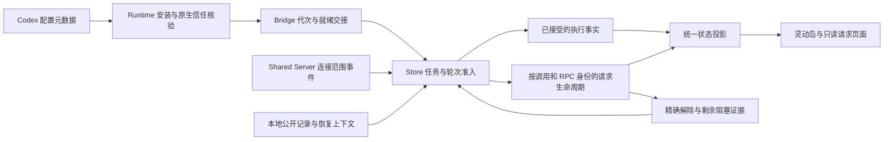

# QuotaView Hook 与请求状态模块梳理

本轮用户要求在推送和合并之前全面梳理相关模块。范围是 Hook 配置、传输与重播、任务准入、请求生命周期和灵动岛状态投影；开发身份保持 0.7.3 / 显示 Build 1 / 内部 49。源码集成见 [PR #67](https://github.com/Duoasa/QuotaView/pull/67)，本文件不代表视觉或真实交互验收。

## 职责与数据流

配置维护负责安装及原生信任，不把收到的事件作为授权证据。Bridge 负责认证、有限持久队列、代次和重播，不猜任务状态。Store 负责唯一准入；内容只附着在被接受的会话和轮次上。请求生命周期负责身份、详情升级和解决。Island 将执行事实与请求证据投影为页面，不用工具活动猜测用户已经确认。

## 必须保持的状态规则

1. **任务准入先于内容显示。** 同一目录 generation、连接 epoch、会话分类和当前轮次裁决通过后，才发布活动、详情或请求；拒绝的旧轮次不能先清空当前灵动岛。
2. **待答与阻塞分开。** 异步问题可以待答且任务继续运行；同步问题、真实审批或明确原生等待才使执行状态等待。终态优先，等待状态从证据派生，不由多个入口反复写入。
3. **工具模式只有一份定义。** Core 统一识别同步/异步提问和有效等待原因；Hook、本地 decoder、公开详情及 Island 使用同一语义。
4. **解决必须有请求范围。** call 身份与 RPC 身份独立；RPC 包含连接 epoch 和原始数字/字符串 ID。启动 ACK、无关工具继续或一次线程等待解除，不代表所有问题已回答。
5. **占位是缺少详情的等待证据。** 只有同调用详情或权威状态才能升级/清理；调用 B 的活动不能清掉调用 A 的等待。不把未知详情包装成命令审批。
6. **时间不能替代请求身份。** 时间用于同来源排序及有界恢复；回答 A 不能以全局时间阈值阻止迟到的独立 B。未知 output 不给尚未观察的未来问题留下解决标记。
7. **恢复需要当前轮次证据。** 磁盘上下文不独自证明任务正在运行；只用 active 用户线程及明确最新 inProgress turn 释放同轮上下文。仅取当前轮次元数据，不取私有推理或全量历史。
8. **应答能力需要原始请求 ownership。** 本地公开投影保持只读；独立 App Server 的写能力不构成桌面请求的响应权。
9. **解除同步执行快照与提醒。** RequestLifecycle 只在同连接已知 RPC 匹配时发出窄解除证据，Store 同步校验当前任务/轮次和剩余阻塞，再复用正常继续事件更新 Core；不在无状态 decoder 中把任意 resolved 当成任务恢复。
10. **配置事实、历史送达和本轮连接分开。** 原生信任只能由配置核验确定；撤销信任后，旧队列和过去的 connected 记录不能重新显示为当前连接。换目录、停止和移除使旧回调失效。
11. **尊重显式禁用。** Codex 自己解析后的 config/read 元数据是偏好依据，QuotaView 不用 TOML 正则猜测是否存在 opt-out；读取失败不盲目启用。

## 审查发现及修复范围

| 已确认的反例 | 责任边界与修复 |
|---|---|
| 异步 launcher 被 PermissionRequest 表示，误判为阻塞 | 统一提问模式；执行事实与待答请求分离 |
| native 公开旧 turn 先写 Island，随后 Registry 才拒绝 | 所有生产公开事件通过同一 Store 准入 |
| 无 threadId 的 resolved 在 Shared 转发条件中丢失 | 在连接范围内关联已观察的 RPC，补充已知任务身份 |
| 并行工具 B 继续执行，清掉 A 的 generic wait | 占位清理与详情升级按调用范围处理 |
| 线程 waiting flag 解除，把无关 async B 也记为已回答 | 线程阻塞与逐请求解决分离 |
| bootstrap 真实问题直接重放，但当前 turn 没有准入 | 用有界当前 turn 元数据确认恢复上下文，再附着公开详情 |
| 启动重播早于配置就绪，拒绝后永远不重试 | 明确 paused/ready 交接与 retained queue drain |
| 旧回调在换目录后给新安装写证据 | Runtime 与 FileBridge 的独立运行代次校验 |
| 合法旧事件把已撤销的信任恢复成 connected | 原生信任与历史/本轮送达分离 |
| inline/quoted TOML 禁用未被正则识别 | 使用原生解析的有效配置与来源元数据 |
| 请求页面已恢复，Core 快照和提醒仍等待 | 同轮次、同连接的精确解除证据同步更新 Core；并行阻塞未清时不恢复 |
| 停用清理失败后自动维护重新安装 | 停用意图先持久化，资源清理失败仅报告残留，重新检查遵循停用偏好 |

## 验证与已知边界

必要隔离冒烟应走 Shared → Store → Island 的真实生产接收顺序，覆盖上述轮次、RPC、并行请求、恢复及重播反例；同时保留纯请求序列和原生配置边界检查。GitHub CI 运行仓库完整 Swift 测试。本地只做受影响的必要冒烟、构建、包身份/签名和源码指纹核对；不扩大到截图或 UI 自动化。最终计数、构建与启动证据在[开发交付](quotaview-0.7.3-development-delivery-2026-10-01.md)中记录。

传输维持现有有限能力：socket 的 750 ms 预算超时可携同 eventID 回退队列，由准入层去重；队列容量 128、保留 300 秒，不保证无限离线或无限突发无损。Own writer 的 advisory lock 与文件修订比较降低并发覆盖，非合作第三方写入不具有系统 CAS。这些边界不通过新增 daemon、权限或猜测状态掩盖。
