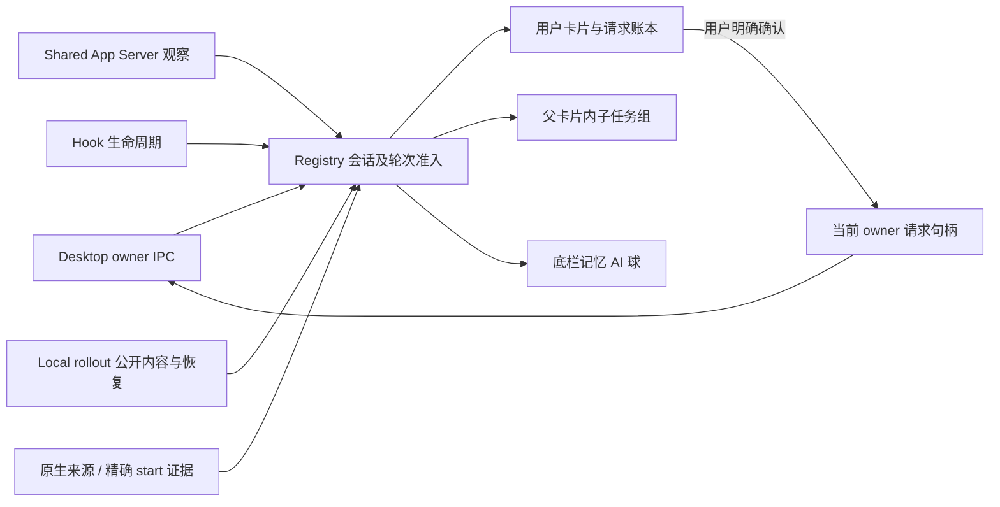

# Codex 与灵动岛的信息契约

Spec ID：`QV-PRODUCT-CODEX-ISLAND-INFORMATION-001`
状态：`Accepted / Verifying` · 2026-10-04

## 参考证据及其边界

用户要求整体梳理通信、来源、生命周期和展示，参考 Vibe Island。其[官方更新记录](https://vibeisland.app/changelog/)明确支持 Desktop 问答/批准、父卡片内的并行子 agent、子 agent 自己的模型，以及后台安全审查卡片抑制；[隐私说明](https://vibeisland.app/privacy/)说明 Hook 活动在本机传递。

本机 Vibe Island 主程序与 helper 的只读静态检查进一步发现 owner IPC discovery、stream follow/state、owner/reconnect 清理、独立 App Server 用量读取、rollout 恢复、子任务 bootstrap gate，以及原生 submit-user-input / approval / elicitation 消息。它并非仅凭 Hook 拼 UI。静态字符串只能证明支持字段与消息名，无法证明完整运行分支；不把字符串或截图当成开源实现。

Vibe 还包含内置记忆/后台工作者规则，其中部分依赖 cwd、prompt 前缀。QuotaView 用户要求准确区分并保留记忆展示，因此采用原生来源和精确轮次证据，不照抄这些推断规则。参考证据整理于 `/private/tmp/quotaview-vibe-memory-subagents-static-20261004.md`（临时只读记录）；以下契约由生产源码和反例验证。

## 四种身份与两层作用域

| 身份 | 原生证据 | 展示 | 用户操作能力 |
|---|---|---|---|
| 用户会话 | 可靠 user 来源及已准入生命周期 | 普通卡片与用户统计 | 仅当前 owner、连接代次和请求句柄允许 |
| 用户派生子 agent | `parentThreadId` 或 `source.subAgent/subagent.thread_spawn.parent_thread_id`，父字段一致 | 对应父卡片的子任务组；自身状态/模型/时长 | 只读，不因父关系继承批准或问答能力 |
| 后台记忆 | 原生 `memory_consolidation` 来源，或当前执行 start 的同名 trigger | 独立底栏 AI 球；不进入列表或触发弹出 | 无 |
| 其他内部任务 | review/compact/guardian 等内部来源，或未能验证的泛 subagent 标识 | 不作为用户会话或用户子任务 | 无 |

线程来源是持久身份，执行目的只属于准确 `(sessionHash, turnHash)`。轮次记忆证明不能永久覆盖用户/子 agent 来源，来源更新也不能撤销当前记忆执行。标题 `memories`、`memories_v2`、目录名、模型缺失及工具参数均不提供分类权。后台任务的真实完成、失败、中断和断线分别保留。

## 通道各司其职

- Desktop IPC 跟随当前拥有者的会话快照、请求和响应能力；回传必须匹配 conversation、turn、request、owner、epoch。选中选项及编辑输入仅改草稿，点击确认才提交。断线、owner 切换、轮次结束立即撤销旧能力。
- Shared App Server、Hook、Local rollout 提供观察证据与恢复。独立 App Server 可读用量，但不能由“连接成功”推断它拥有 Desktop 任务或有权回复。
- 原生 start 读取是身份补充，不是生命周期来源；读到某个记忆标记不能伪造任务开始或完成。子任务关系也不能虚构仍在执行的历史子 agent。
- 公共助手正文和工具状态可用于进展；私有 reasoning、`agent_message` / inter-agent 私信、加密内容不进入展示。公开进展独立保存，工具结束不能把它一并清空。

应答链路分别记录“用户确认”“当前 owner 接受回传”“真实请求结算”“Codex 前端关闭”，不能用前一阶段推断后一阶段。尤其是异步问题，现有 `thread-follower-submit-user-input` 回传成功并不证明原生提问组已关闭；不得再发送一次相同答案，也不能以整组 Dismiss/Skip 清理可能包含其它草稿的问题。原生精确组关闭仍未完成，边界与隔离合同见[原生提问关闭规格](../design/codex-native-question-closure-contract-2026-10-03.md)。本轮来源/子任务调整不扩大此能力。

## 同步、预算与恢复

每个所选 Codex 数据目录和 native generation 共用一个 `CodexLocalExecutionMetadata.Service`；Hook classifier 和 Local 刷新不再各自创建互不一致的读取缓存。服务按线程的最新 start 记录确定当前执行；单个超限、失败或未覆盖线程不清除其他已验证身份。`ReadResult` 区分完整、部分和失败，并显式返回已覆盖/失败 session 集合。

保留原有 24 小时、50 ms、64 KiB 单条、2 MiB 总读取限制。薄索引发现按最新头部与 keyset 历史游标推进，hash→原始线程映射及偏好列表有界；已准入的当前轮次优先查询并轮换，避免一个高活动线程占满记录窗口。已覆盖线程的最新非记忆 start 可撤销该线程旧证明，部分读取不能撤销未覆盖证据。

Store 接到早于生命周期的精确记忆身份时，保存有界 pending evidence。只有同 generation、同 session、同 turn 的真实事件准入才能消费；不同轮次、旧代次、停止和淘汰不会污染当前任务。分类缓存读取时限也按 session+turn 判断，新轮次不受上一轮读取节流阻挡。身份迟到时撤回普通卡片和旧请求展示，转入后台球；不回答或归档 Codex 任务。

子任务先保留权威关系，再以真实 Registry 准入事件建立运行状态。迟到关系只重放已准入的真实事件；来源失效时显示状态待更新，终态不被旧事件复活。关系、显示 title、公开内容和自己的模型分别传递，随机 nickname 不覆盖真实 title。事件、内容、任务统计和请求账本不互相冒充。

执行 Registry 的 128 个槽位与持久来源的 1024 项 LRU 是不同预算。执行逐出会立即撤销对应子任务的运行投影，同时有界保留来源/父子关系；后续真实正向事件才可重新准入，单独元数据或结束事件不能恢复执行。来源 LRU 逐出也撤回关系与运行投影。Shared 每条子任务观察投影附带本连接已验证的原生父关系，避免稀疏消息在 Store 缓存缺失时退成用户来源。停止或目录更换撤销整代观察。

诊断只记录 hash 前缀、轮次 hash、generation、pending/applied/rejected，以及读取状态和覆盖数量；不记录提示正文、答案、私信或原始线程 ID。这样下一次异常可区分“没读到”“读到未匹配”“已匹配但展示错误”。

### 长会话恢复与显示元数据

2026-10-04 当前会话的只读记录证实：rollout 已超过 280 MiB，末尾 16 MiB 内无本轮 `task_started`，但真实 `turn_context` 与用量记录仍存在。恢复不得因此丢弃独立线程显示元数据，也不扩大读取预算或全量扫描文件。

原生数据库的明确 `name` 优先于旧 `title` 和目录名占位；模型、思考等级和累计线程 Token 独立补齐已有卡片，空值不清空有效信息。占位标题不能阻止迟到真实标题，也不能覆盖已有高可信标题。仅元数据不创建任务、不改变轮次或执行状态、不赋予问题/批准权限；无卡片时只作有界缓存，真实生命周期准入后才应用。

尾部 `turn_context.turn_id` 仅能匹配当前 Registry 已准入执行的 `(sessionHash, turnHash)` 后恢复本轮 decoder。若真实生命周期晚于首次 bootstrap，允许固定预算重扫一次；历史轮次、旧代次及已结束执行不得借此复活。恢复的 Token 必须继续满足线程/轮次及累计关系校验；历史待确认状态和问题不随补读重放。最近同轮公开助手消息在原200条/2MiB内容预算内保留；工具洪流不能挤掉它，换轮撤销保护。历史tool/output只恢复公开条目，不改变working/thinking、不清当前工具或结算请求。首次Hook观测时间不是本轮真实起点，因此精确同轮累计展示可接受更早记录并取单调最大值，Store本轮账本保持独立。

Build3的101项必要冒烟、实际Core对当前长会话的只读恢复、fresh开发/Universal构建及真实运行包验证通过；证据与未发布状态见Handoff当前节，视觉仍待用户验收。

## 卡片投影及验收

2026-10-04：主卡与子agent背板统一背景/描边计算；未选中白色描边从0.055提高到与背板一致的0.16，hover/选中为0.22，完成态保留原绿色。整个堆叠组共用hover，主卡与伸出横条同步高亮；列表和审批头卡使用同一规则。底栏记忆球与刘海收起状态共用18pt小球组件，原22pt仅为历史尺寸。必要检查及运行包以[Handoff最新节](../../HANDOFF.md)为准，视觉待用户验收。

主卡片状态行使用当前工具、仍活动的子任务摘要或最近公开进展，避免只剩“思考中”。子 agent 单独在父卡片后方叠出一条 28 pt 底卡：整组的下层背景从主卡后方延伸到底，实心主卡遮住后层，保留主卡自身底部圆角；不另外上移带顶边的短圆角横条。主卡片本身和噪点画布不包含子任务行。固定 Codex 图标及灰色分组名称/括号，数量用白色，右侧全部已准入子任务横排显示自身图标、名称、模型、状态和时长；溢出以重复副本单向滚动，隐藏及 Reduce Motion 停止。单行高度与 agent 数量无关，仍计入同一滚动几何；保持详情收起和原生用户滚动事务。完整文本由 help/辅助功能保留，子任务不增加用户会话数，隐私模式不展示子任务名称或公开正文。

子 agent 图标沿用本机 Codex 原生 28 款暗色 SVG 图形和颜色，以原始 threadID / conversationId 的 UTF-16 单元计算 `(hash * 31 + codeUnit) % 2147483647`，再 `% 28`；不使用 nickname、title、父 ID 或 QuotaView session hash。资源在本地构建时转换为 64 px 透明 PNG，按 14 pt 使用，App 与 SwiftPM 均打包。头像占位及文字统一 11 pt 字体，横向头像占位固定 14 pt，各子任务之间固定 24 pt；rich lane 的文字使用显式 CoreText 基线，以字体现有 capHeight 中心对齐头像。普通与闪烁文字不改变。可核查的当前 renderer 位置、原始 SVG SHA 和固定索引反例保存在 `.build/073-agent-avatar-evidence/`；此兼容规则不宣称未来 Codex 版本永不改变。

主卡片末尾共用 Codex 图标及归档槽位，hover 卡片时显示归档，归档仍仅清理灵动岛显示且不同时触发卡片选择。量子噪点保留现有 shader 与 60 FPS；业务状态切换保留帧间时钟，只在真实播放/暂停边界清除不活动时间，同尺寸布局不重复调整 Metal 画布。

本轮源码、实际构建输入与已运行开发包分别记录于 Handoff。必要的解析、预算、乱序、旧轮次、旧 generation、子任务隔离、公共/私有内容及滚动几何冒烟覆盖这条契约；真实交互与视觉由用户验收。此文不宣称未实测的 Vibe 完整实现或未取得的 Codex 能力。
