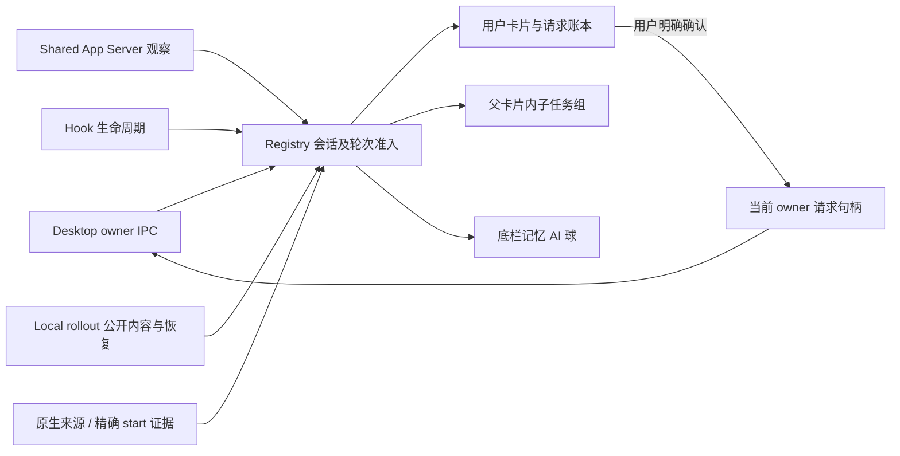

# Codex 与灵动岛的信息契约

Spec ID：`QV-PRODUCT-CODEX-ISLAND-INFORMATION-001`
状态：`Accepted / Verifying` · 2026-10-05

## 参考证据及其边界

用户要求整体梳理通信、来源、生命周期和展示，参考 Vibe Island。其[官方更新记录](https://vibeisland.app/changelog/)明确支持 Desktop 问答/批准、父卡片内的并行子 agent、子 agent 自己的模型，以及后台安全审查卡片抑制；[隐私说明](https://vibeisland.app/privacy/)说明 Hook 活动在本机传递。

本机 Vibe Island 主程序与 helper 的只读静态检查进一步发现 owner IPC discovery、stream follow/state、owner/reconnect 清理、独立 App Server 用量读取、rollout 恢复、子任务 bootstrap gate，以及原生 submit-user-input / approval / elicitation 消息。它并非仅凭 Hook 拼 UI。静态字符串只能证明支持字段与消息名，无法证明完整运行分支；不把字符串或截图当成开源实现。

Vibe 还包含内置记忆/后台工作者规则，其中部分依赖 cwd、prompt 前缀。QuotaView 用户要求准确区分并保留记忆展示，因此采用原生来源和精确轮次证据，不照抄这些推断规则。参考证据整理于 `/private/tmp/quotaview-vibe-memory-subagents-static-20261004.md`（临时只读记录）；以下契约由生产源码和反例验证。

## 四种身份与两层作用域

| 身份 | 原生证据 | 展示 | 用户操作能力 |
|---|---|---|---|
| 用户会话 | 可靠 user 来源及已准入生命周期 | 普通卡片与用户统计 | 仅当前 owner、连接代次和请求句柄允许 |
| 用户派生子 agent | `parentThreadId` 或 `source.subAgent/subagent.thread_spawn.parent_thread_id`，父字段一致 | 对应父卡片的子任务组；自身状态/模型/时长 | 只读，不因父关系继承批准或问答能力 |
| 后台记忆 | 原生 `memory_consolidation` 来源，或当前执行 start 的同名 trigger | 独立底栏 AI 球；不进入列表或触发弹出 | 无 |
| 其他内部任务 | review/compact/guardian 等内部来源，或未能验证的泛 subagent 标识 | 不作为用户会话或用户子任务 | 无 |

线程来源是持久身份，执行目的只属于准确 `(sessionHash, turnHash)`。轮次记忆证明不能永久覆盖用户/子 agent 来源，来源更新也不能撤销当前记忆执行。标题 `memories`、`memories_v2`、目录名、模型缺失及工具参数均不提供分类权。后台任务的真实完成、失败、中断和断线分别保留。

Hook 的 `session_id` 是通道观察身份，不能直接等同原生 thread ID。官方 [Hook 定义](https://learn.chatgpt.com/docs/hooks)允许子 agent Hook 使用父会话 session；2026-10-05现场验证一个记忆 Hook 的 session hash 为 `985c838a42ec`，原生线程为 `5f72dc66e4b0`，准确 turn 均为 `78c2e8dfbec4`。只有一个原生记忆线程具有该准确 turn 证明时，Hook 执行可绑定其原生 `(sessionHash, turnHash)`；多个线程冲突时拒绝改写，非 Hook 通道不借用这种绑定。该绑定只作用当前执行，宿主别名的来源、父执行和其他轮次保持独立。来源无法确定的 unknown 不进入普通用户投影或统计。

## 通道各司其职

- Desktop IPC 跟随当前拥有者的会话快照、请求和响应能力；回传必须匹配 conversation、turn、request、owner、epoch。选中选项及编辑输入仅改草稿，点击确认才提交。断线、owner 切换、轮次结束立即撤销旧能力。
- Shared App Server、Hook、Local rollout 提供观察证据与恢复。独立 App Server 可读用量，但不能由“连接成功”推断它拥有 Desktop 任务或有权回复。
- 原生 start 读取是身份补充，不是生命周期来源；读到某个记忆标记不能伪造任务开始或完成。子任务关系也不能虚构仍在执行的历史子 agent。
- 公共助手正文和工具状态可用于进展；私有 reasoning、`agent_message` / inter-agent 私信、加密内容不进入展示。公开进展独立保存，工具结束不能把它一并清空。

应答链路分别记录“用户确认”“当前 owner 接受回传”“真实请求结算”“Codex 前端关闭”，不能用前一阶段推断后一阶段。同步问题使用 `thread-follower-submit-user-input`，原生异步问题使用 `thread-follower-steer-turn`；回传成功均不证明原生提问组已关闭。不得再发送一次相同答案，也不能以整组 Dismiss/Skip 清理可能包含其它草稿的问题。原生精确组关闭仍未完成，边界与隔离合同见[原生提问关闭规格](../design/codex-native-question-closure-contract-2026-10-03.md)。本次等待修复和本地退场不扩大此能力。

## 观察等待与本地提醒退场 · 2026-10-05

用户已授权修复系统文件访问提示后的残留等待与异步问题长期接管。0.7.5 / Build7 / 内部56首次实现已本地交付；后续CI恢复修订尚未重新编译或安装，源码及合并检查见 [PR #77](https://github.com/Duoasa/QuotaView/pull/77)。当前为Verifying，真实交互与视觉待用户验收。已运行Build6的证据不作为本次验证结果。

### 等待证据与恢复

- Hook `PermissionRequest` 是观察等待，不直接证明 macOS TCC 或一个可回答RPC。匿名Hook观察保留发生时间、工具名及已有call身份；这些字段不创造请求权限。有call身份的后续恢复必须精确同call，工具名相似不能充当RPC身份。
- 无显式call的Hook关联仅在保存历史中恰有一个同工具、在观察时仍活动的call时成立；迟到并发start会撤销先前唯一推断。已完成工具历史有界修剪并推进时间floor；历史缺口、旧于floor的不确定start或缓存溢出拒绝唯一推断，不能用“当前只剩一个”填补缺失证据。`source:nil`弱观察可本地隐藏，但不参与Hook关联推断。
- 完整当前owner pending集合中的真实阻塞身份可作为聚合证据替代同轮弱匿名观察，不猜测匿名Hook与某一个RPC一一对应。只有同conversation、turn、owner和epoch的对应账本身份全部消失，且没有正向runtime waiting，才可清除该聚合等待。
- 未支持的pending身份仍参与完整集合；pending不完整、owner/epoch变化或来源不可用不能作为“已处理”证据。并行请求、匿名来源等待和runtime等待分别保留。强等待不按固定超时清除。
- 弱generic提醒允许仅在QuotaView本地隐藏；隐藏不调用响应路由、不发送答案或resolved，也不结算执行等待或owner请求。此本地操作独立于`canRespond`，只读或结果未知仍可交还Codex。
- 每轮最多保存256个permission notice fingerprint；相同notice重播不重启已隐藏的弱提醒，容量满后也不以无法记录的新notice重新弹出。隐藏偏好不阻止后续真实owner RPC进入。
- 原生同步问题RPC显式标记为synchronous，真实RPC准入不受观察call墓碑否决。工具开始、完成只撤回对应弱观察；真实RPC只能依赖精确native request settlement或同作用域完整owner账本结算，不能把同call工具事件当作原生RPC已回答。
- Desktop合成PermissionRequest只更新Store活动，不再经legacy回调向Island生成丢失owner的AppServer等待；Island的Desktop等待仅来自已准入owner projection。Shared AppServer来源等待保持独立。正向重观察真实blocker可迁移runtime等待到新owner；空集合无法迁移旧owner等待。
- 精确同来源call恢复或可信同call结果为已观察的弱提醒留下独立、有界256项退场记录；无明确来源不提供结算证明。弱退场记录不等于已回答，不拒绝后来出现的真实异步题或RPC。Local/Hook mode也不能把真实同步问题RPC降级为非阻塞。

### 原生异步问题的本地展示期限

当前Desktop IPC/Projection未暴露renderer的原生缩略状态、`selectedQuestionKey`或`deadlineMs`。本地退场期限只管理QuotaView展示，不证明Codex已缩略、问题已回答或原生问题组已关闭；不使用AX，不增加系统权限。

| 当前状态 | 本地展示规则 | 结算边界 |
|---|---|---|
| 未接管、未回答 | 首次有效显示起30秒退场，重复快照不重置 | 到期只隐藏此异步问题 |
| 已接管 | 实际草稿变更标记接管，保留问题 | 聚焦、hover或重复渲染不代替草稿变更 |
| 提交中 `.submitting` | 不自动退场 | 不重发、不切换响应路由 |
| 已发送 `.sent` / 结果未知 `.resultUnknown` | 进入该阶段后保留3秒，再本地交回Codex | 不改写为已回答，不再发送一次答案 |
| 精确原生回答 / 真实turn终态 | 按对应问题与真实生命周期清理 | 不清除并行请求，不伪造终态 |

退场按thread、turn与原生`questionItemId`组成的哈希持久记录，最多4096项；不保存题目、草稿或答案。已退场的同作用域问题在重复快照、重连和应用重启后不重新接管；用户后来在Codex补答仍只更新真实结算证据。账本有界，不承诺无限历史身份永久去重。同步RPC、未知pending及非问题等待不进入异步展示计时器。

首次本地交付已完成对应源码与静态通道审查，未新增或运行本地测试；后续GitHub自动CI及恢复记录见Handoff。首轮Universal Distribution构建因两处`source` optional API适配编译错误失败，原日志保留于`.build/075-confirmation-lifecycle-20261005/build7-distribution-build-first-failure.log`；修正后第二次Universal构建成功。正式本地包已运行：App PID62058、Widget PID62064，版本0.7.5 / Build7 / 内部56。190项生产输入与4项安装二进制哈希一致，App/Widget/Core/Hook均含arm64+x86_64；同Developer ID Team的deep strict签名核对通过。App/Widget entitlements及NS权限声明与旧包严格相同；实际exe、Core加载、活动socket、启动后Hook ACK与Local生命周期准入均核对通过。没有新增公证或公开发布，Stable/appcast仍为Build3。

本轮交付证据位于`.build/075-confirmation-lifecycle-20261005/runtime/`：`build7-preflight.json`、`build7-delivery.json`、`build7-installed-verification.json`、`build7-live-channel-verification.json`、`build7-live-loaded-paths.log`及`build7-live-channel.log`。旧包保留于`.build/runtime-package-backups/confirmation-build7-20261005T130323Z/QuotaView.app`。用户已授权源码推送与CI通过后的main集成，对应提交和结果见 [PR #77](https://github.com/Duoasa/QuotaView/pull/77)；后续CI源码修订未重新编译或安装，上述190项输入及包证据属于首次本地交付；本次不发布Release/appcast。原生minimize精确同步、原生问题组关闭、视觉和真实交互仍未记录为完成，最终状态随[Handoff](../../HANDOFF.md)中的本轮证据更新。

## 同步、预算与恢复

每个所选 Codex 数据目录和 native generation 共用一个 `CodexLocalExecutionMetadata.Service`；Hook classifier 和 Local 刷新不再各自创建互不一致的读取缓存。服务按线程的最新 start 记录确定当前执行；单个超限、失败或未覆盖线程不清除其他已验证身份。`ReadResult` 区分完整、部分和失败，并显式返回已覆盖/失败 session 集合。

保留原有 24 小时、50 ms、64 KiB 单条、2 MiB 总读取限制。薄索引发现按最新头部与 keyset 历史游标推进，hash→原始线程映射及偏好列表有界；已准入的当前轮次优先查询并轮换，避免一个高活动线程占满记录窗口。已覆盖线程的最新非记忆 start 可撤销该线程旧证明，部分读取不能撤销未覆盖证据。

Store 接到早于生命周期的精确记忆身份时，保存有界 pending evidence。只有同 generation、准确原生 session/turn 的真实事件准入才能消费；Hook 原生身份绑定必须先通过上方唯一 turn 规则。不同轮次、旧代次、停止和淘汰不会污染当前任务。分类缓存读取时限也按 session+turn 判断，新轮次不受上一轮读取节流阻挡。

身份晚于 Hook 生命周期时，使用当前目录/generation 内有界128份真实 Hook 观测迁移同 turn 的开始与终态；来源元数据不能生成新的生命周期。单独结束证据不能建立执行，终态先到不被晚到开始复活，SessionEnd 仍清理执行。撤回只作用旧 Hook 别名下同 turn 的普通卡片、选择和对应展示；若别名已承载父会话新轮次，不能撤销父执行或清空其显示元数据/可靠来源。已绑定观测不再次由元数据回放旧开始；只有Registry真正接受的结算建立终态墓碑。被更强来源拒绝的Hook stop不成为墓碑，仍活跃的逐出执行可由新真实正向事件重新准入。重复事件与迟到元数据不能恢复已逐出的旧执行。记忆进入既有后台球，不回答或归档 Codex 任务。

子任务先保留权威关系，再以真实 Registry 准入事件建立运行状态。迟到关系只重放已准入的真实事件；来源失效时显示状态待更新，终态不被旧事件复活。关系、显示 title、公开内容和自己的模型分别传递，随机 nickname 不覆盖真实 title。事件、内容、任务统计和请求账本不互相冒充。

执行 Registry 的 128 个槽位与持久来源的 1024 项 LRU 是不同预算。执行逐出会立即撤销对应子任务的运行投影，同时有界保留来源/父子关系；后续真实正向事件才可重新准入，单独元数据或结束事件不能恢复执行。来源 LRU 逐出也撤回关系与运行投影。Shared 每条子任务观察投影附带本连接已验证的原生父关系，避免稀疏消息在 Store 缓存缺失时退成用户来源。停止或目录更换撤销整代观察。

诊断只记录 hash 前缀、轮次 hash、generation、pending/applied/rejected，以及读取状态和覆盖数量；不记录提示正文、答案、私信或原始线程 ID。这样下一次异常可区分“没读到”“读到未匹配”“已匹配但展示错误”。

2026-10-05复现的两个临时线程都有原生记忆 start，真实读取服务四次10.87/10.17/9.58/11.73 ms均精确匹配两个轮次；本次漏分流来自 Hook session 与原生 thread 的身份差异及 unknown 的普通投影入口，不能归因于解析或预算。新增反例覆盖共享宿主、多个记忆线程、迟到身份、父新轮次、终态先到与重复事件。Build3隔离候选最终124条相关冒烟及Universal无签名构建通过，App/Core/Hook/Widget架构与版本核对通过；构建Core的真实来源加合成Hook别名验证、首轮失败及源码交付见Handoff。用户随后授权本地替换，记忆修复的上轮正式运行安装为0.7.5/Build4/内部53，逻辑与已检查候选逐项一致，版本递增没有重新执行该124条冒烟。该轮Distribution Universal Release、190项生产输入、双架构、同Developer ID签名与实际Core加载核对通过；当时主PID46174、Widget PID46182。后续待机百分比与纯色描边修订曾本地安装Build6/内部55，当前Build7/内部56延续该逻辑并含上方等待与退场修复，活动通道、旧包备份及交付证据以本轮记录和Handoff最新节为准；未新公证或公开发布，Stable/appcast仍为Build3，视觉由用户验收。

### 长会话恢复与显示元数据

2026-10-04 当前会话的只读记录证实：rollout 已超过 280 MiB，末尾 16 MiB 内无本轮 `task_started`，但真实 `turn_context` 与用量记录仍存在。恢复不得因此丢弃独立线程显示元数据，也不扩大读取预算或全量扫描文件。

原生数据库的明确 `name` 优先于旧 `title` 和目录名占位；模型、思考等级和累计线程 Token 独立补齐已有卡片，空值不清空有效信息。占位标题不能阻止迟到真实标题，也不能覆盖已有高可信标题。仅元数据不创建任务、不改变轮次或执行状态、不赋予问题/批准权限；无卡片时只作有界缓存，真实生命周期准入后才应用。

尾部 `turn_context.turn_id` 仅能匹配当前 Registry 已准入执行的 `(sessionHash, turnHash)` 后恢复本轮 decoder。若真实生命周期晚于首次 bootstrap，允许固定预算重扫一次；历史轮次、旧代次及已结束执行不得借此复活。恢复的 Token 必须继续满足线程/轮次及累计关系校验；历史待确认状态和问题不随补读重放。最近同轮公开助手消息在原200条/2MiB内容预算内保留；工具洪流不能挤掉它，换轮撤销保护。历史tool/output只恢复公开条目，不改变working/thinking、不清当前工具或结算请求。首次Hook观测时间不是本轮真实起点，因此精确同轮累计展示可接受更早记录并取单调最大值，Store本轮账本保持独立。

2026-10-04 Build3交付的101项必要冒烟、实际Core对当时长会话的只读恢复、fresh开发/Universal构建及真实运行包验证通过；发行事实见版本历史，证据见Handoff的长会话恢复历史节。该验证不代替2026-10-05新增记忆身份反例与本轮运行包核对，视觉仍待用户验收。

## 卡片投影及验收

2026-10-05当前规则：已连接且用户任务列表为空时显示“就绪 / Ready”。没有可聚焦任务的收起状态左侧仅显示剩余百分比（0–100范围），未知为“—”，不显示用量环或倒计时；展开栏保持完整用量。无物理刘海时状态居中，有物理刘海时左翼仅百分比、右翼为状态与会话数，摄像头区域留空。待机help/辅助标签同步只含百分比，真实任务状态、离线等待和独立后台记忆入口保持。主卡、子agent背板、审批头卡共用1pt不透明sRGB描边：普通#181818，选中/hover#202020，alpha固定1；不使用白色透明度叠加。整个组同步hover，背景与完成态原纯色绿色/高光保持。Build6/内部55为该UI修订的历史本地交付，Universal构建、同Developer ID签名、190项生产输入和活动连接核验通过，该轮未新增或执行测试。当前Build7/内部56保留此UI规则，运行证据见上方本轮交付记录与[Handoff最新节](../../HANDOFF.md)，视觉待用户验收。

同日Build5历史交付曾复用完整用量环/百分比/倒计时，并使用白色0.08/0.12透明描边；用户后续修订以上方当前规则为准。该轮本地替换、Universal构建、签名和活动连接证据保留于Handoff历史节，不作为Build6重复执行结果。

2026-10-04历史基线：主卡与子agent背板统一背景/描边计算；当时未选中白色描边从0.055提高到与背板一致的0.16，hover/选中为0.22，当前颜色以上方纯色修订为准。整个堆叠组共用hover，主卡与伸出横条同步高亮；列表和审批头卡使用同一规则。底栏记忆球与活动任务的刘海收起状态共用18pt小球组件，原22pt仅为历史尺寸。

主卡片状态行使用当前工具、仍活动的子任务摘要或最近公开进展，避免只剩“思考中”。子 agent 单独在父卡片后方叠出一条 28 pt 底卡：整组的下层背景从主卡后方延伸到底，实心主卡遮住后层，保留主卡自身底部圆角；不另外上移带顶边的短圆角横条。主卡片本身和噪点画布不包含子任务行。固定 Codex 图标及灰色分组名称/括号，数量用白色，右侧全部已准入子任务横排显示自身图标、名称、模型、状态和时长；溢出以重复副本单向滚动，隐藏及 Reduce Motion 停止。单行高度与 agent 数量无关，仍计入同一滚动几何；保持详情收起和原生用户滚动事务。完整文本由 help/辅助功能保留，子任务不增加用户会话数，隐私模式不展示子任务名称或公开正文。

子 agent 图标沿用本机 Codex 原生 28 款暗色 SVG 图形和颜色，以原始 threadID / conversationId 的 UTF-16 单元计算 `(hash * 31 + codeUnit) % 2147483647`，再 `% 28`；不使用 nickname、title、父 ID 或 QuotaView session hash。资源在本地构建时转换为 64 px 透明 PNG，按 14 pt 使用，App 与 SwiftPM 均打包。头像占位及文字统一 11 pt 字体，横向头像占位固定 14 pt，各子任务之间固定 24 pt；rich lane 的文字使用显式 CoreText 基线，以字体现有 capHeight 中心对齐头像。普通与闪烁文字不改变。可核查的当前 renderer 位置、原始 SVG SHA 和固定索引反例保存在 `.build/073-agent-avatar-evidence/`；此兼容规则不宣称未来 Codex 版本永不改变。

主卡片末尾共用 Codex 图标及归档槽位，hover 卡片时显示归档，归档仍仅清理灵动岛显示且不同时触发卡片选择。量子噪点保留现有 shader 与 60 FPS；业务状态切换保留帧间时钟，只在真实播放/暂停边界清除不活动时间，同尺寸布局不重复调整 Metal 画布。

本轮源码、实际构建输入与已运行开发包分别记录于 Handoff。必要的解析、预算、乱序、旧轮次、旧 generation、子任务隔离、公共/私有内容及滚动几何冒烟覆盖这条契约；真实交互与视觉由用户验收。此文不宣称未实测的 Vibe 完整实现或未取得的 Codex 能力。

## 完成回答与刷新成本 · 2026-10-05

完成详情直接使用本轮 Codex 公开 final / final_answer 消息，保留 Markdown 段落、强调、列表、代码及可点击链接；不混入工具执行、历史折叠或原文展开。旧协议缺省 phase 时兼容最后一条 assistant 消息，明确 commentary 不作结果。终态后的同轮完整 assistant item 或 local final 仅补齐内容，不恢复执行、进度或批准状态。现有 200 条 / 2 MiB 缓存与单项长度预算继续生效，缺失和截断明确说明。

使用 Foundation Markdown 与原生 NSTextView，不读取 Codex 私有渲染器或增加权限。网页链接由用户点击后打开；绝对文件路径去掉行号后由 Finder 定位，不执行链接脚本。解析与文本高度复用详情缓存；摘要有界扫描、重复 display 不发布、同批设置更新合并及扫光时钟连续规则见[效果契约](PROGRESS_EFFECT_ADAPTATION.md#8-2026-10-05-刷新与动画连续性修订)。用户后续授权运行后已启动最小增量开发编译产物，源码交付、开发主 PID 与 CI 见 Handoff；实际效果由用户验收。

22:51 空白正文反馈的修正：实际显示视图必须持有并连接独立的 TextKit 存储、排版器和容器；不得向 NSTextView 指定初始化方法传 nil 后靠可选链写入。缓存的测量成功不代表显示栈存在，CI 编译成功也不代表实际正文可见。根因与增量开发运行记录见 Handoff。
